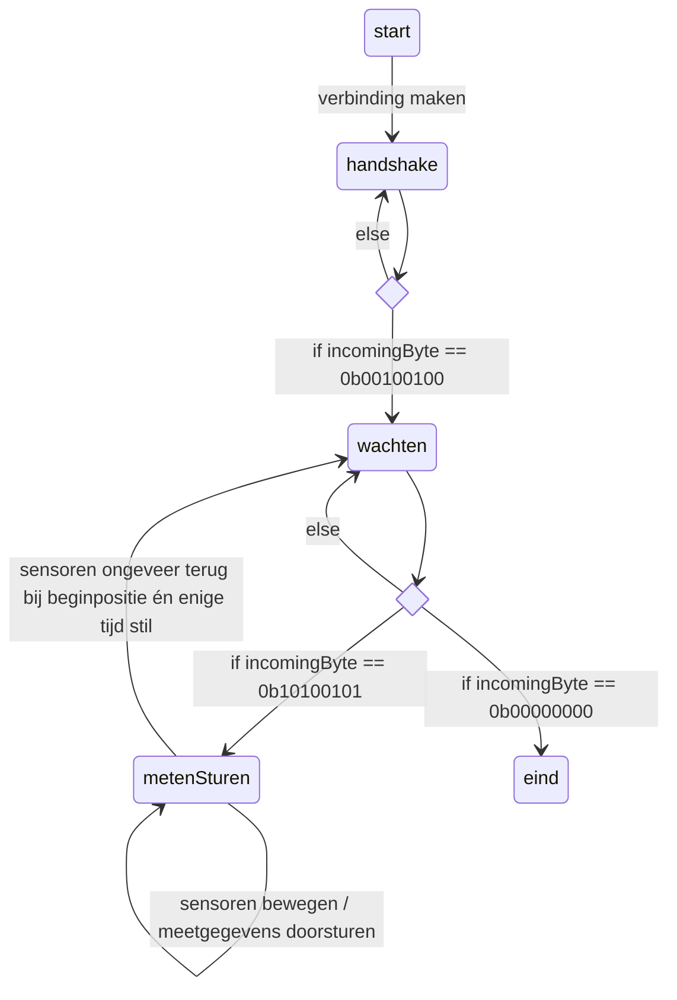

%%
# Wat heb ik ervan geleerd
Vergeleken met mijn eerdere state-diagrammen heb ik niet veel nieuws geleerd, behalve dat dit diagram is gemaakt met Mermaid. Daarnaast zijn er ruitjes toegevoegd op de plekken waar keuzes worden gemaakt. Ik weet nog niet zeker of dit correct is binnen de notatie, dit zal ik aan mijn docent vragen om te bevestigen.

%%