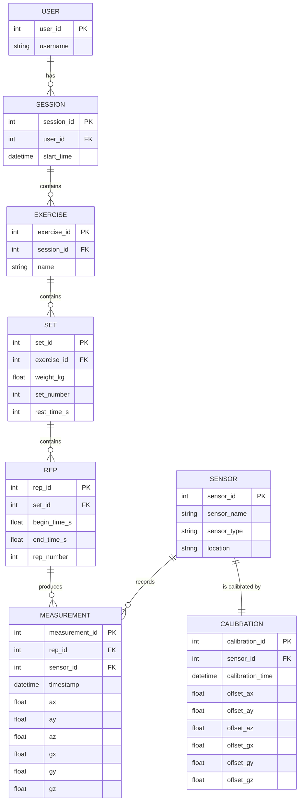

%%
# Crows foot notatie
||--||    : één-op-één
||--o{    : één-op-veel
}|--||    : veel-op-één
}o--o{    : veel-op-veel
o|--||    : optioneel één
o{--||    : optioneel veel
|{--o{    : minimaal 1..N
o{--o{    : optioneel veel-op-veel

# Datatype Cheatsheet 

## Numeriek
| Type      | Gebruik                  |
|-----------|-------------------------|
| `INT`     | Hele getallen, IDs, aantallen |
| `BIGINT`  | Grote getallen           |
| `SMALLINT`| Kleine getallen          |
| `FLOAT`   | Kommagetallen, metingen, gewicht |
| `DOUBLE`  | Hogere precisie float    |
| `DECIMAL` | Exacte decimalen (bijv. valuta) |

## Tekst
| Type        | Gebruik                  |
|-------------|-------------------------|
| `CHAR(n)`   | Vaste lengte tekst       |
| `VARCHAR(n)`| Variabele lengte tekst, namen, types |
| `TEXT`      | Lange teksten, notities  |
| `STRING`    | Mermaid/ER generiek, meestal `VARCHAR` |

## Datum / Tijd
| Type        | Gebruik                     |
|-------------|-----------------------------|
| `DATE`      | Alleen datum (jaar-maand-dag) |
| `TIME`      | Alleen tijd (uur:min:sec)    |
| `DATETIME`  | Datum + tijd exact           |
| `TIMESTAMP` | Datum+tijd met timezone      |
| `INT`       | Unix epoch timestamp (sec/ms)|

## Boolean / Logisch
| Type       | Gebruik           |
|------------|-----------------|
| `BOOLEAN`  | Waar / Onwaar, flags zoals isActive |

## Overig / Speciaal
| Type           | Gebruik                        |
|----------------|--------------------------------|
| `BLOB` / `BYTEA` | Bestanden, afbeeldingen       |
| `UUID`         | Unieke ID’s                    |

**Tips kort:**
- IDs → `INT` of `UUID`  
- Metingen/gewichten → `FLOAT`  
- Namen/locaties → `STRING` / `VARCHAR`  
- Timestamps → `DATETIME` of `INT` (epoch)  

# Wat ik heb geleerd

Tijdens het werken aan het ER-diagram met Mermaid in Obsidian heb ik meerdere belangrijke inzichten opgedaan die zowel mijn technische vaardigheden als mijn praktische werktoepassing versterken.

- **Gebruik van cheatsheets**  
  Door een cheatsheets te gebruiken, kon ik snel de juiste datatype-keuzes maken. Dit zorgde ervoor dat ik bewuster nadacht over wat ik precies wilde registreren, bijvoorbeeld dat het gewicht van een set beter een `FLOAT` is in plaats van een `INT`, omdat halve of kwart kilo’s ook mogelijk zijn. Het gebruik van cheatsheets maakt het overzichtelijk, ook al weet ik nog niet alles uit het hoofd.

- **Mermaid in Obsidian is mijn oplossing**  
  Ik heb ervaren dat Mermaid, in combinatie met Obsidian, duidelijke voordelen biedt ten opzichte van traditionele tools zoals Draw.io. Omdat Mermaid werkt op basis van syntax, zijn diagrammen makkelijker aan te passen, kunnen velden eenvoudig worden gewijzigd en kunnen opmerkingen toegevoegd worden zonder dat dit zichtbaar is in het eindproduct.

  Door te zoeken naar een tool die past bij mijn manier van werken en waarvan mijn intuïtie zegt dat dit ook grote uitdagingen kan aanpakken, ben ik uiteindelijk bij Mermaid terechtgekomen. Vooral het besef dat diagrammen tekenen ook volledig via syntax kan, vond ik een belangrijk en leerzaam moment.

- **Brontaal en notatieconsistentie zijn belangrijk**  
  Mijn eerdere Chen-diagram was in het Nederlands, waardoor ik veel termen moest vertalen. Hierdoor realiseerde ik me dat het aanhouden van één brontaal (bijvoorbeeld Engels) overzicht en consistentie bevordert en fouten voorkomt.

- **Veldnamen en datatypes bewust kiezen**  
  Het bedenken van veldnamen zoals `weight_kg` of `begin_time_s` voelt als een puzzel, maar helpt om het systeem beter te begrijpen. Het dwingt me ook om praktisch na te denken over de data die ik registreer en hoe deze wordt gebruikt in latere analyses.

- **Praktische toepassing voor werk**  
  Voor mijn werk sta ik voor de uitdaging om vervuilde, oude datasets om te zetten naar nieuwe, gestandaardiseerde datasets. Door mijn ervaring met Mermaid en het structureren van dit diagram heb ik geleerd hoe ik data overzichtelijk kan visualiseren en structureren. Door de oude datasets met Mermaid te visualiseren, kan ik hopelijk achterhalen hoe gegevens vroeger aan elkaar gekoppeld waren en wat het doel van elk veld was. Zodra ik het doel van een veld begrijp, kan ik bepalen welke waarden fout zijn kan ik bepalen of ze omgevormd kunnen worden of beter verwijderd kunnen worden.

## Bronnen per prompt

1. **Cheatsheet voor datatypes**  
   **Bron:** ChatGPT (GPT-5 mini, OpenAI), 2025  
   **Beschrijving:** Deze prompt gebruikte ik om een compacte cheatsheet te maken voor datatypes in databases (numeriek, tekst, datum/tijd, boolean, overig).  
   **Prompt:** *"geef mij een cheatseat van alle mogelijkheden float int string etc; geef een korte nederlandse compacte cheat sheet; geef dit in markdown"*

3. **Crow's Foot notatie overzicht**  
   **Bron:** ChatGPT (GPT-5 mini, OpenAI), 2025  
   **Beschrijving:** Deze prompt gebruikte ik om een overzicht te krijgen van alle mogelijke Crow's Foot relaties en notaties in mermaid.  
   **Prompt:** *"geef een overzicht van alle crow's foot notaties met uitleg van ||--||, ||--o{, o{--o{ etc."*

4. **Verbetering en structurering van mijn tekst**  
   **Bron:** ChatGPT (GPT-5 mini, OpenAI), 2025  
   **Beschrijving:** Deze prompt gebruikte ik om mijn originele tekst over wat ik geleerd heb te herschrijven tot een logisch lopend verhaal dat begrijpelijk is voor mijn docent.  
   **Prompt:** *"pas dit document aan. Pas niks meer aan aan de mermaid code. maar maak van de rest een logisch verhaal. het gaat erom dat mijn docent kan begrijpen wat ik ervan heb geleerd het is voor een hbo studie. Voeg deze prompt toe aan de bronvermelding."*

%%