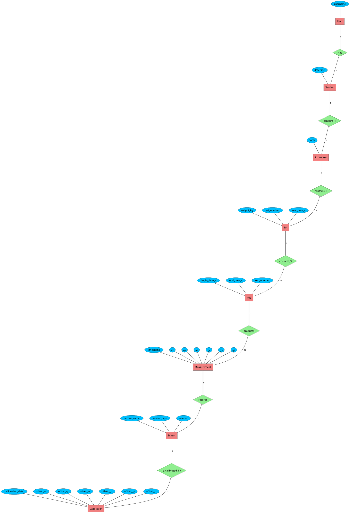

```plantuml
@startchen
<style>
.red {
BackGroundColor #f08080
FontColor #000000
}
.blue {
BackGroundColor #00bfff
FontColor #000000
}
.green {
BackGroundColor #90ee90
FontColor #000000
}
</style>

' Entiteiten
entity User <<red>> {
	username <<blue>> {
	}
}
entity Session <<red>> {
	datetime <<blue>> {
	}
}
entity Excercises <<red>> {
	name <<blue>> {
	}
}
entity Set <<red>> {
	weight_kg <<blue>> {
	}
	set_number <<blue>> {
	}
	rest_time_s <<blue>> {
	}
}
entity Rep <<red>> {
	begin_time_s <<blue>> {
	}
	end_time_s <<blue>> {
	}
	rep_number <<blue>> {
	}
}
entity Measurement <<red>> {
	timestamp <<blue>> {
	}
	ax <<blue>> {
	}
	ay <<blue>> {
	}
	az <<blue>> {
	}
	gx <<blue>> {
	}
	gy <<blue>> {
	}
	gz <<blue>> {
	}
}
entity Sensor <<red>> {
	sensor_name <<blue>> {
	}
	sensor_type <<blue>> {
	}
	location <<blue>> {
	}
}
entity Calibration <<red>> {
	calibration_date <<blue>> {
	}
	offset_ax <<blue>> {
	}
	offset_ay <<blue>> {
	}
	offset_az <<blue>> {
	}
	offset_gx <<blue>> {
	}
	offset_gy <<blue>> {
	}
	offset_gz <<blue>> {
	}
}

' relationship
relationship has <<green>> {
}
relationship contains_1 <<green>> {
}
relationship contains_2 <<green>> {
}
relationship contains_3 <<green>> {
}
relationship produces <<green>> {
}
relationship records <<green>> {
}
relationship is_calibrated_by <<green>> {
}

' connection
User -1- has
has -N- Session

Session -1- contains_1
contains_1 -N- Excercises

Excercises -1- contains_2
contains_2 -N- Set

Set -1- contains_3
contains_3 -N- Rep

Rep -1- produces
produces -N- Measurement

Measurement -N- records
records -1- Sensor

Sensor -1- is_calibrated_by
is_calibrated_by -1- Calibration

@endchen
```
