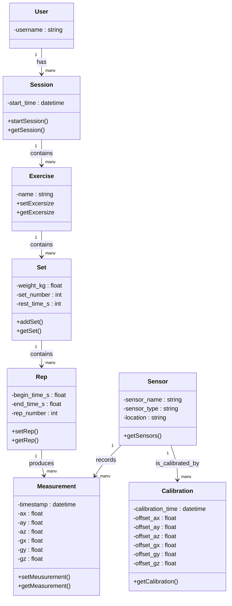

```mermaid
classDiagram
    class User {
        -username : string
    }

    class Session {
        -start_time : datetime
		+startSession()
		+getSession()
    }

    class Exercise {
        -name : string
        +setExcersize
        +getExcersize
    }

    class Set {
        -weight_kg : float
        -set_number : int
        -rest_time_s : int
		+addSet()
		+getSet()
    }

    class Rep {
        -begin_time_s : float
        -end_time_s : float
        -rep_number : int
        +setRep()
        +getRep()
    }

    class Measurement {
        -timestamp : datetime
        -ax : float
        -ay : float
        -az : float
        -gx : float
        -gy : float
        -gz : float
		+setMeusurement()
		+getMeasurement()
    }

    class Sensor {
        -sensor_name : string
        -sensor_type : string
        -location : string
		+getSensors()
    }

    class Calibration {
        -calibration_time : datetime
        -offset_ax : float
        -offset_ay : float
        -offset_az : float
        -offset_gx : float
        -offset_gy : float
        -offset_gz : float
		+getCalibration()
    }

    %% ======== RELATIES ========
    User "1" --> "many" Session : has
    Session "1" --> "many" Exercise : contains
    Exercise "1" --> "many" Set : contains
    Set "1" --> "many" Rep : contains
    Rep "1" --> "many" Measurement : produces
    Sensor "1" --> "many" Measurement : records
    Sensor "1" --> "many" Calibration : is_calibrated_by
```