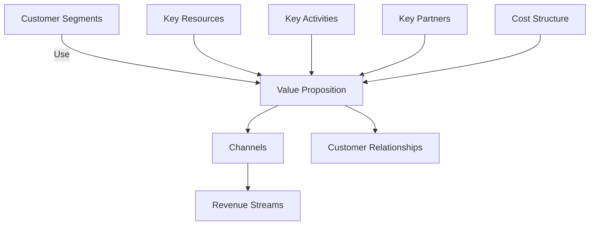
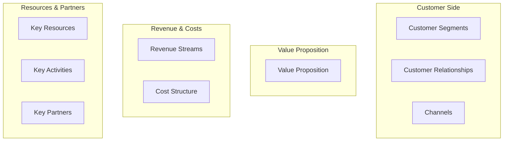
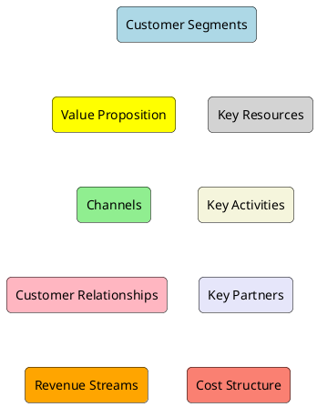
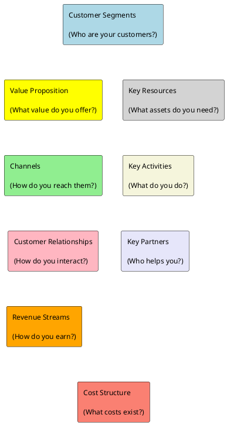
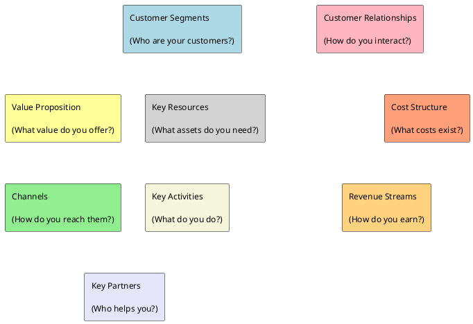

# Inleiding
Tijdens de les is er uitleg gegeven over het Business Model Canvas (BMC) en hoe dit kan worden opgesteld. Voor het project wil ik dit concept ook uitwerken. Omdat het meenemen van een fysiek bord lastig is, wil ik het BMC digitaal visualiseren met behulp van syntax.  

## Mogelijkheden

### Mermaid

#### Flowchart
Onderstaande flowchart is een eerste poging, maar de visualisatie voldoet niet helemaal.  




#### Graphvorm
Een andere poging met een graphvorm, maar deze voldoet eveneens niet.



### PlantUML
#### Grid-achtige opzet
Een eerste PlantUML-versie in grid-vorm, maar nog niet optimaal.



#### Verbeterde grid-opzet
Een tweede poging met een nettere grid-opzet, inclusief beschrijvingen.



### Experimenten met layout
Een poging om front-stage en back-stage componenten duidelijk te maken.



```mermaid
graph TB
  subgraph Front‑stage
    CS["Customer Segments"]
    VP["Value Proposition"]
    CH["Channels"]
    CR["Customer Relationships"]
    RS["Revenue Streams"]
  end

  subgraph Back‑stage
    KR["Key Resources"]
    KA["Key Activities"]
    KP["Key Partners"]
    CSt["Cost Structure"]
  end

  CS --> VP
  VP --> CH
  CR --> RS
  KR --> KA
  KA --> KP
  CSt --> KP

  CS --> KR
  VP --> KA
  CH --> KP
  CR --> CSt
```

## Conclusie
Het blijkt lastig om een BMC via syntax visueel aantrekkelijk weer te geven. Hoewel er diverse opties zijn met Mermaid en PlantUML, blijft het moeilijk om een overzichtelijke en intuïtieve weergave te realiseren. Voor het doel van het project lijkt het werken met post-its op een fysiek bord nog steeds de meest praktische en overzichtelijke methode.

## Bronvermelding
Alle codevoorbeelden in dit document zijn gegenereerd door ChatGPT.