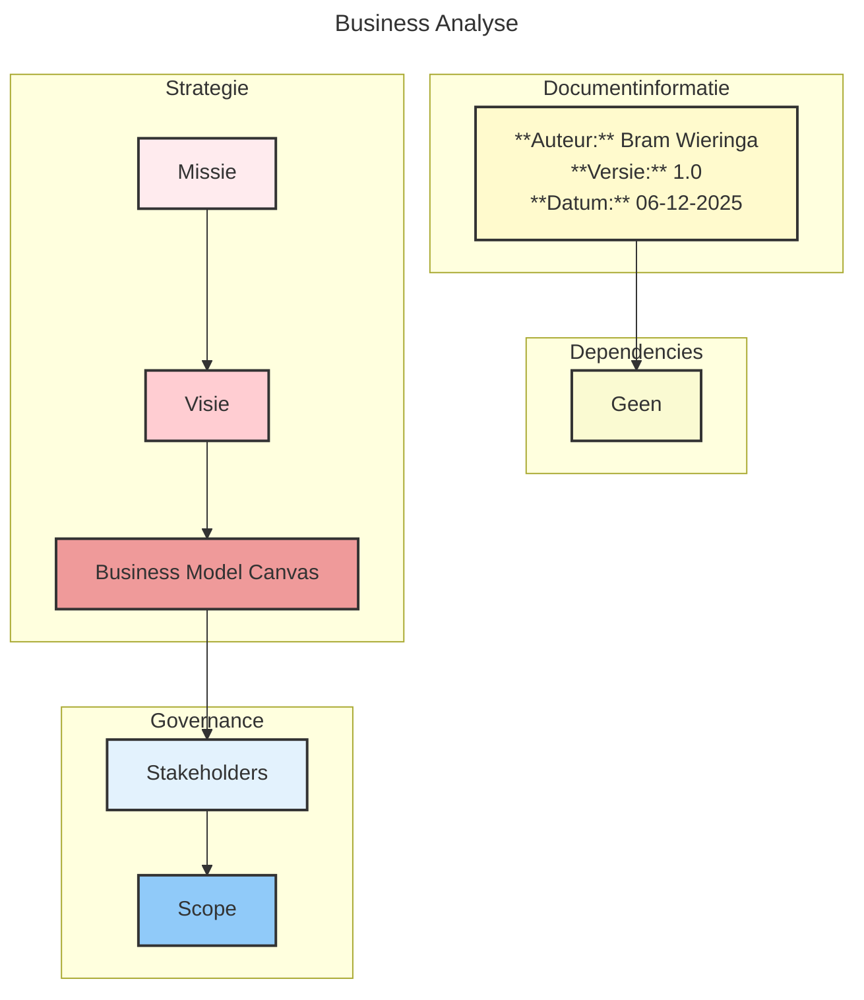
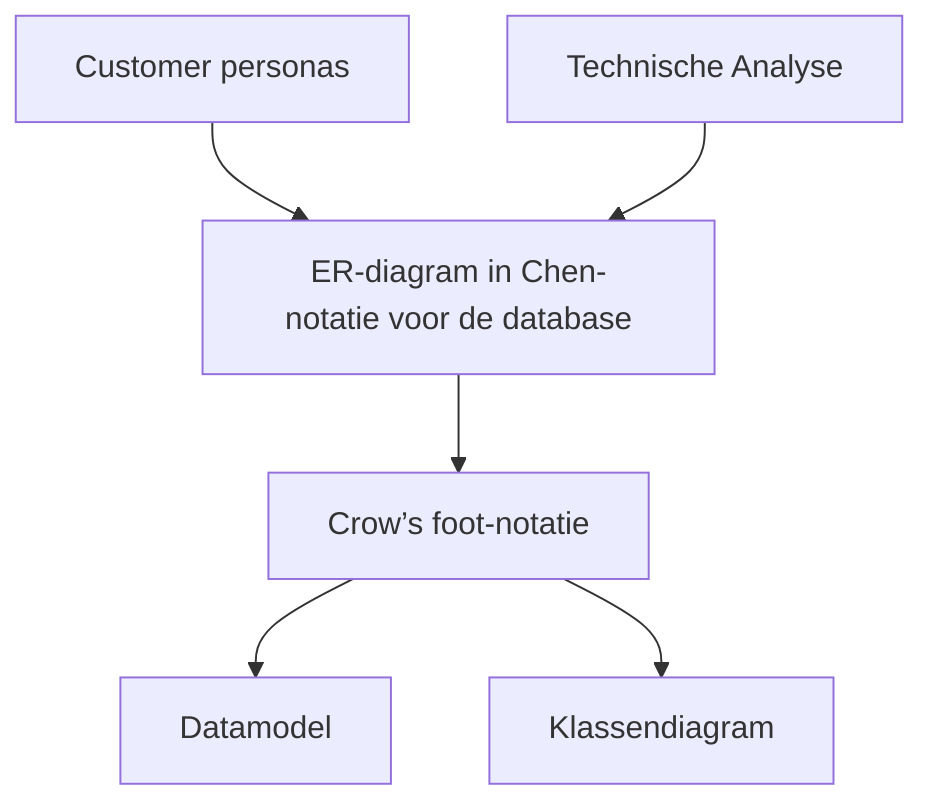
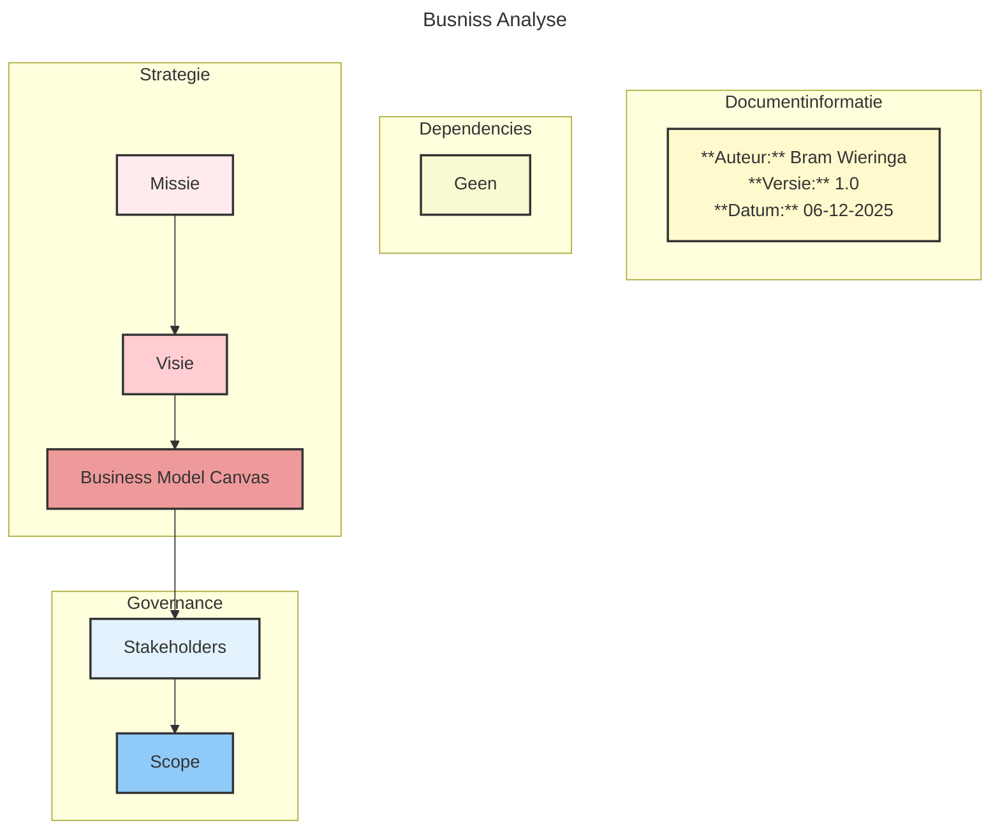

## Metadata
Titel: Reflectie Sem01 3de portfolio moment
Auteur: Bram Wieringa
Datum: 06-12-205
Versie: 1.0

## Inleiding  
In dit document beschrijf ik wat ik van de afgelopen vier weken vond met betrekking tot mijn oriëntatie op mijn studiekeuze.

## Wat heb ik gedaan  
Wat ik voornamelijk heb gedaan, is geprobeerd om op een gestructureerde manier mijn groepje op weg te helpen. Dit is niet gelukt. Dat komt voornamelijk doordat ik nog niet goed genoeg ben om hen voldoende te begeleiden.

Ik ben blij dat ik ervoor heb gekozen dit los te laten en te zien waar het schip strandt met mijn groepje. Voor de beeldvorming: hoe zie ik mijn groepje? Als een stel enthousiaste gasten die het liefst operationeel tot actie komen.

Ook merk ik heel erg, wat denk ik ook komt door mijn werk voor een gemeente, dat mijn gedachtepatroon vooral werkt volgens de watervalmethode is. Grote plannen, duidelijke afspraken, enzovoort. Dit wil ik veranderen naar een **Agile mindset**, denk dat dit ook beter is voor mijn werk.

In de eerste week heb ik een probleemanalyse gemaakt voor mijn groep, maar dat zou ik nu al niet meer doen. Hoe ik het nu wél zou aanpakken, weet ik ook nog niet zeker. Het liefst zou ik als eerste beginnen met een businessanalyse. Wat is de business, waar staat deze voor, waar wil zij heen en wie zijn de mensen daarin?

Als je dit weet, kan je samen met de Product Owner een probleem gaan voorbereiden. Bijvoorbeeld in ons geval de klachtenregistratie. Daarvoor zou je het volgende kunnen maken:

Hier moet dan nog ergens de techinse analyse tussen komen v

## Afsluiting

Dit is hoe ik er op dit moment tegenaan kijk na de afgelopen vier weken. Mijn manier van werken is in ontwikkeling en ik merk duidelijk dat mijn achtergrond en werkervaring hierin een grote rol spelen.

%%
## Inleiding
In dit document ga ik beschreven wat ik van de afgelopen 4 weken vondt met betrekking tot mijn orientatie voor mijn studiekeuze.

## Wat heb ik gedaan
Wat ik voornamelijk heb gedaan is het proberen om weg te helpen van mijn groepje, op een gestructureerde manier. Dit is niet gelukt, maar dat komt voornamelijk omdat ik nog niet goed genoeg ben zodat ik ze voldoende kan begeleiden. 

Ik ben blij dat ik heb gekozen om dit los te laten en te zien waar het schip gaat stranden met mijn groepje. Voor de beeldvorming, hoe zie ik mijn groepje? Als een stel enthaisasten gasten die het liefst operationeel tot actie komen.

IOk merk heel erg, komt denk ik ook daar mijn werk voor een gemeente, dat mijn gedachtepratroon vooral waterfall methdoie is. GRote plannen, duidelijk afspraken en enzovoort.

In de eerste week heb ik een probleemanalyse gemaakt voor mijn groep, maar dat zou ik nu al niet meer doen. Hoe ik het wel zou aanpakken, weet ik ook nog niet zeker. Het liefst als eerste met een busniss analyse. Wat is de busniss, waar staat het voor, waar wil het heen en wie zijn de mensen daarin.

Als je dit weet kan je met de Productowner een probleem gaan voorbereiden. Bijvoorbeld in ons geval de klachtenregistratie. Dan zou je daarvoor het volgende kunenn maken:

- Customer personas van de gebruikers van deze klachtenregistratie
- ER-diagram Chen notatie voor de database, vervoglens de crowsfeet en daaruit de data model en klassediagram.
-

%%