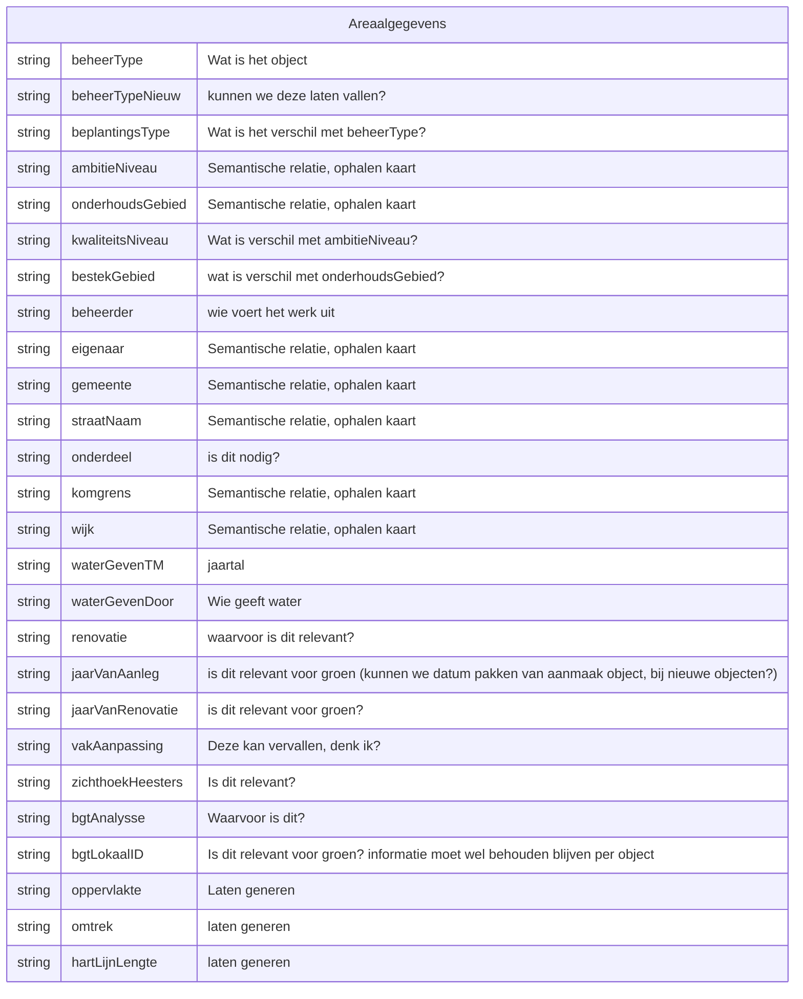
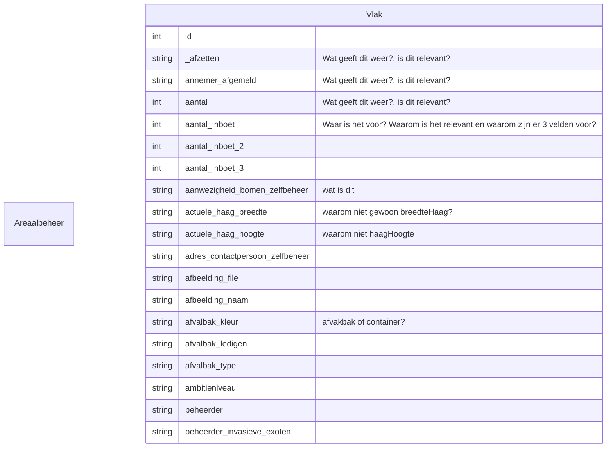
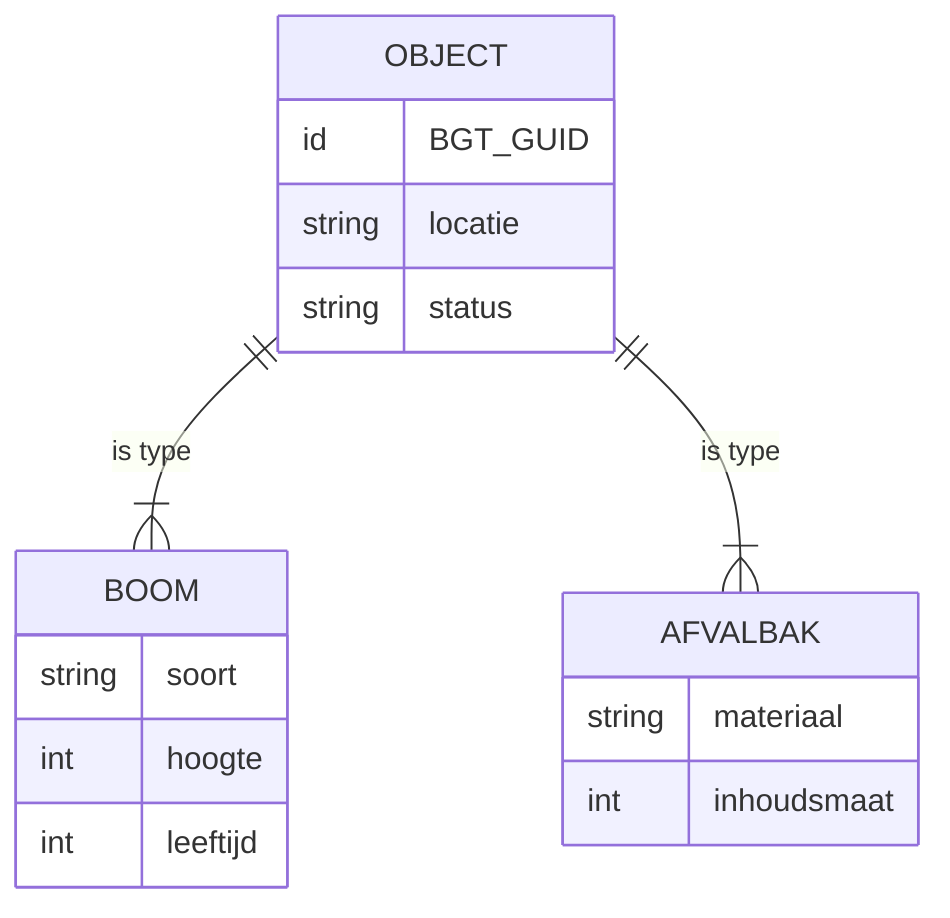

```mermaid

erDiagram
    Areaalgegevens {
        string beheerType "Wat is het object"
        string beheerTypeNieuw "kunnen we deze laten vallen?"
        string beplantingsType "Wat is het verschil met beheerType?"
        string ambitieNiveau "Semantische relatie, ophalen kaart"
        string onderhoudsGebied "Semantische relatie, ophalen kaart"
        string kwaliteitsNiveau "Wat is verschil met ambitieNiveau?"
        string bestekGebied "wat is verschil met onderhoudsGebied?"
        string beheerder "wie voert het werk uit"
        string eigenaar "Semantische relatie, ophalen kaart"
        string gemeente "Semantische relatie, ophalen kaart"
        string straatNaam "Semantische relatie, ophalen kaart"
        string onderdeel "is dit nodig?"
        string komgrens "Semantische relatie, ophalen kaart"
        string wijk "Semantische relatie, ophalen kaart"
        string waterGevenTM "jaartal"
        string waterGevenDoor "Wie geeft water"
        string renovatie "waarvoor is dit relevant?"
        string jaarVanAanleg "is dit relevant voor groen (kunnen we datum pakken van aanmaak object, bij nieuwe objecten?)"
        string jaarVanRenovatie "is dit relevant voor groen?"
        string vakAanpassing "Deze kan vervallen, denk ik?"
        string zichthoekHeesters "Is dit relevant?"
        string bgtAnalysse "Waarvoor is dit?"
        string bgtLokaalID "Is dit relevant voor groen? informatie moet wel behouden blijven per object"
        string oppervlakte "Laten generen"
        string omtrek "laten generen"
        string hartLijnLengte "laten generen"
    }
```

```mermaid
erDiagram
    Areaalbeheer Vlak {
        int id
        string _afzetten "Wat geeft dit weer?, is dit relevant?"
        string annemer_afgemeld "Wat geeft dit weer?, is dit relevant?"
        int aantal "Wat geeft dit weer?, is dit relevant?"
        int aantal_inboet "Waar is het voor? Waarom is het relevant en waarom zijn er 3 velden voor?"
        int aantal_inboet_2 ""
        int aantal_inboet_3 ""
        string aanwezigheid_bomen_zelfbeheer "wat is dit"
        string actuele_haag_breedte "waarom niet gewoon breedteHaag?"
        string actuele_haag_hoogte "waarom niet haagHoogte"
        string adres_contactpersoon_zelfbeheer
        string afbeelding_file
        string afbeelding_naam
        string afvalbak_kleur "afvakbak of container?"
        string afvalbak_ledigen
        string afvalbak_type
        string ambitieniveau
        string beheerder
        string beheerder_invasieve_exoten
    }
```

```mermaid
erDiagram
    OBJECT {
        id BGT_GUID
        string locatie
        string status
    }

    BOOM {
        string soort
        int hoogte
        int leeftijd
    }

    AFVALBAK {
        string materiaal
        int inhoudsmaat
    }

    OBJECT ||--|{ BOOM : "is type"
    OBJECT ||--|{ AFVALBAK : "is type"

```
