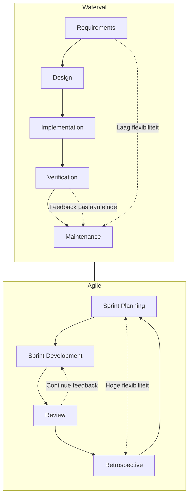

# Agile, Scrum & Aanverwante Methodes – Lesnotities

## 1. Agile: de basis
Agile is een verzameling werkmethodes voor softwareontwikkeling die flexibel inspelen op veranderingen. In plaats van één groot plan vooraf, werk je in korte iteraties waarbij steeds een stukje werkend product wordt opgeleverd.

### Agile Manifesto (4 principes)
1. **Individuals and interactions** over **processes and tools**
2. **Working software** over **comprehensive documentation  **
3. **Customer collaboration** over **contract negotiation  **
4. **Responding to change** over **following a plan**

## 2. Waterval vs Agile (uitgebreid)

### Watervalmodel
Het **watervalmodel** is de klassieke manier van softwareontwikkeling. Het bestaat uit vaste opeenvolgende fasen:

**Requirements → Design → Implementation → Verification → Maintenance**

**Kenmerken:**
- Elke fase moet volledig afgerond zijn voordat de volgende start.
- Wijzigingen in een latere fase zijn moeilijk en kostbaar.
- Documentatie is uitgebreid; focus ligt op vooraf bepalen van alle eisen.
- Feedback komt pas aan het eind (bij oplevering).

**Voordelen:**
- Helder en gestructureerd proces.  
- Goed te plannen en te budgetteren.  
- Geschikt bij projecten met stabiele eisen.

**Nadelen:**
- Slecht flexibel bij veranderende wensen.  
- Risico dat het eindproduct niet goed aansluit bij de gebruikersbehoefte.  
- Fouten of misverstanden komen vaak pas laat aan het licht.

### Agile
**Agile** pakt het anders aan: iteratief en adaptief. Het product wordt in korte cycli (sprints) ontwikkeld, met regelmatige feedback en oplevering van werkende software.

**Kenmerken:**
- Kortcyclisch, met continue oplevering van waardevol werk.
- Gemakkelijk aanpasbaar bij veranderende wensen.
- Gebruiker/klant wordt continu betrokken.
- Documentatie beperkt tot wat nodig is voor samenwerking en kennisoverdracht.

**Voordelen:**
- Snelle feedback en aanpassing aan veranderende behoeften.  
- Betere aansluiting bij wat de gebruiker daadwerkelijk nodig heeft.  
- Risico’s en fouten worden sneller ontdekt en opgelost.  
- Motiverend voor teams door zichtbare resultaten per sprint.

**Nadelen / uitdagingen:**
- Minder voorspelbaar qua planning en budget (flexibiliteit kan onzekerheid geven).  
- Vereist betrokken, goed geïnformeerde stakeholders.  
- Team moet zelforganiserend zijn en Agile principes begrijpen.

### Overzicht vergelijking

## 3. Andere Agile-methodes
- **Kanban**  
  Continu werkmanagement via een board.  
  Focus op doorstroom en kwaliteit.  
  *Verschil met Scrum*: geen sprints; continue flow.

- **XP (Extreme Programming)**  
  Gericht op technische excellentie: TDD, pair programming, refactoring.

- **Lean Software Development**  
  Minimal waste, maximale waarde.

# 4. Scrum

## Rollen
- **Product Owner**  
  Bepaalt *wat* en *waarom*; prioriteert de product backlog.

- **Scrum Master**  
  Facilitator van het proces; verwijdert obstakels; organiseert meetings.

- **Scrum Team**  
  Zelforganiserend, cross-functioneel; 5–9 personen.  
  Bepaalt *hoe* en *hoe snel* er geleverd wordt.

## User Stories & Backlog

### User Stories
Formaat:  
**As a _[user role]_ I want _[functionality]_ so that _[value]._**

Altijd inclusief:
- Business value  
- Schatting (complexiteit / story points)  
- **Acceptance criteria**

### Backlogs
- **Product Backlog**: volledige lijst met wensen/eisen.  
- **Sprint Backlog**: selectie van items die in deze sprint worden opgepakt.

## Scrum Events

### Daily Scrum
- Max 15 minuten  
- Wat heb je gedaan? Wat ga je doen? Blokkades?  
- Geen technische discussies  
- Bij jullie: wekelijks of tweewekelijks

### Sprint Planning
Bepalen van sprintdoel en selectie van backlog items.

### Sprint Review
Demo van het opgeleverde werk, feedback door PO/docenten/stakeholders.

### Sprint Retrospective
- Wat ging goed?  
- Wat kan beter?  
- Stop / Start / Continue

## Sprint Board (Scrum Task Board)
Typische kolommen:
1. Product Backlog  
2. Sprint Backlog  
3. In Progress  
4. Peer Review  
5. In Test  
6. Done

## Tools voor Agile projectmanagement
- Jira  
- Azure DevOps  
- Trello (meest toegankelijk)

# Snel Overzicht / Schema

### Agile kern
- Iteratief  
- Flexibel  
- Samenwerking  
- Continue waarde leveren

### Scrum cyclus
**Sprint Planning → Sprint → Review → Retrospective → nieuwe Sprint**

### Scrum rollen
- Product Owner → wat/waarom  
- Scrum Master → proces  
- Team → hoe + leveren

### Artefacts
- Product Backlog  
- Sprint Backlog  
- Increment

### User Story structuur
_As a… I want… so that…_

### Belangrijkste Scrum Meetings
Daily → Planning → Review → Retro

%%
# Agile basic
gebasseed op scrum, toeganelijk manier om met agile te werken

requirments -> design -1. implementation -> vertification -> maintance

launch -> plan -> design -> build -> test -> revieuw -> launche

scrum - kanban
scrum dwingt af dat je een gereed product oplevert tov kanban. Kanban meer kwaliteit dan kwantieit

XP xtreme programming
lean software devolpment isook agile

Manifesto for agile software
leer dit eens
individuals and interactions over process and tools
working software over comprehensive documentation
customer collaboration over contract negotion
respond to change over following a plan

- product backlog 
	- requirments is de backlog
- sprint planning meeting
- sprint backlog
- sprint
	- daily scrum voor ons weekley or bi weekly daily scrums in ons geval. Wat heb je gedaan afgelpoen dagen, wat is klaar, wat ga ik nog doen tot einde van sprint
- finished work
	- sprint review
	- sprint retrospective

Rollen
product owner = ownswhat is desired and why
scrum master process, facilitator
team owns how and how quicly work is deliverd

scrum master
- bijvoorbeeld he kan jij pietje helpen met provleem x
- removes ovstacles that impact productivity, schoolzetting is dit er niet echt
- organiseet de meetings en faciliteert het

product owner
waht moet er gemaakt worden
prioritetit voor de backlog

teams
self organiserentn
cross functional
flexibelcreatief en productief
5-9 personen

user stories
as a _user role_ i want to _functionaliteit_ so that _value_
rated door busnisss value en complexity

accpetance criteria, waar moet het aan voldoen

lisjt met user stories en accpetance criteria komt in de backlog
	- product owner besluit wat als eerste te bouwen

scrum events
- dailt scrum meeting
	- quiqck aligment
	- gaan we de sprint goal halen
	- use the sprint board
	- 15 min max
	- no technical details
- sprint planning meeting
- sprint review meeting
- sprint retrospective meeting

Sprint board
scrum task board
- product back log
- sprint backlog
- in process
- peer review
- in testt
- done

Tootls agile project management tool
- Jira
- Azure devops
- Trello is het meest toeganeklijk

sprint review
docenten / product owner

sprint retrosperctif
wat ging goed, wat kan beter

whatdo we need to stop doing
continue doing
start doing to improve our process

in de presenatie staan intressante links

%%