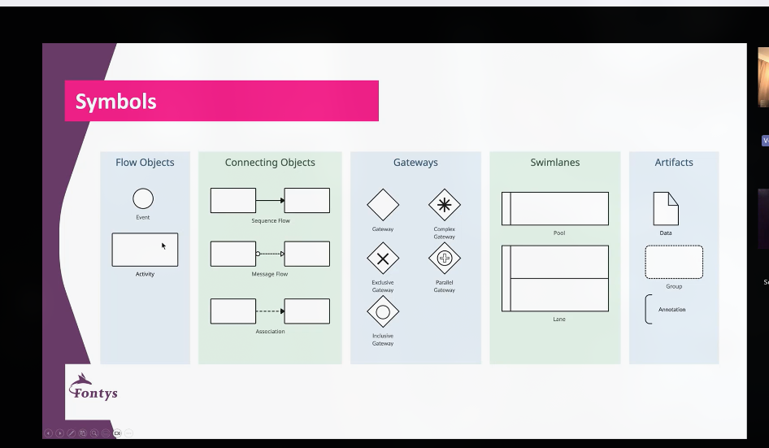

Wat heb ik geleerd

# Les 1
## SQL, R & Python belangrijk voor data-visualisatie
### [[Werkboek R]] en [[datacamp.com]]
## Test dashboards altijd met testdata! Klopt de pi chart wel met 50/50 of laat die bij 50/50 20/80 zien.
## Pas op met open tekstvelden, dan moet je eerst alles categoriseren voordat je het kan visualiseren. 

# Les 2
## Data is storytelling
### Het verhaal kunnen vertellen over: het proces, de wens en de opdrachtgever
## Vragen:
### Uni-variate vs histogram, wat is het verschil

# Les 3
## [[ER Diagram]] basis
## [[Chen notatie]]
## Visual paradigm
## Vragen
### Wat is het verschil tussen [[ER Diagram]] en [[EER Diagram]]
#### Verschil is: 
### Welke notaties zijn er nog meer?
#### [[Chen notatie]]
#### [[Crow's foot notatie]]
#### meer?
##### Waarom kies je de een en niet de ander?
### Waarom N:M en niet N:N, verschil daartussen
####  N is 0, 1 of meer en M is 1, 2, of meer, maar dit staat niet vast

# Les 4 – Van ER-diagram naar Database

## Recap ER-diagram
- Basis voor: klasse diagram en database  
- **Entiteiten:** rechthoek  
- **Attributen:** ovaal  
- **Relaties:** ruit (met naam en kardinaliteit)  
- **Tools:** Virtual Paradigm, SmartDraw, Canva, Edraw  
- **Notatie:** Chen-notatie  

## Database
- Relaties kunnen ook attributen hebben  

### Stap 1 – Tabellen maken
- Elke entiteit (rechthoek) wordt een tabel  
- Elk veld heeft een unieke ID (meestal integer)  

### Stap 2 – Attributen toevoegen
- Voeg alle attributen van de entiteit toe aan de tabel  

### Stap 3 – Relaties omzetten
- Kardinaliteit: 0, 1 of n  
- **Foreign key:** verwijst naar ID in een andere tabel  
- **Bij n–n relaties:** maak een **koppeltabel**  
  - Naam: combineer de twee entiteiten of verzin een zinvolle naam  
  - Voeg attributen van de relatie toe  

**Voorbeelden:**  
- `Patient – Medicijn` → `PatientMedicijn(PatientID, MedicijnID, Aantal, Tijdstip)`  
- `Patient – Docter` → `Behandelaar(PatientID, DocterID)` (combinatie is uniek, geen aparte ID nodig)  

### Foreign key gedrag bij verwijderen
1. **Mandatory:** verwijderen verboden als er nog koppelingen zijn  
2. **Cascade:** verwijdert automatisch alle gekoppelde records  
3. **Set to null:** verwijst naar null bij verwijdering  

## Extra notities
- **Crow’s foot notatie:**  
  - `0` = 0 of 1  
  - `1` = altijd minstens 1  
  - Meer info: [Crow's Foot ERD Tutorial](https://medium.com/@callista.m.azizah/crows-foot-erd-for-beginners-a-tutorial-1effc8a326c6R)  

- **Praktisch:**  
  - Student Square portal: eigen database maken  
  - Azure Data Studio kan ook (SQL Server)  
  - Mockaroo.com: random data genereren  
  - R Studio script beschikbaar om verbinding te maken met SQL Server en data uit Excel te uploaden (script bij Kees)  

## Wat je hebt geleerd
- Koppeltabellen maken bij n–n relaties  
- Crow’s foot notatie begrijpen  
- ER-diagram vertalen naar een database voor je applicatie

# Les 5 Basis procesmodelener
waarde toe brengen aan de organisatie

Karakteristiek van een proces
- Doel gericht, wanneer endigt het proces of wanneer is het doel bereikt
- Stap-voor-stap, duidelijke stsappen
- Herhaalbaar, kan je telkens opnieuw op de zelfde manier doen
- gedfineert door input en output, beignpunt en eindepunt
- meetbaar, hoeveel tyijd kost elke stap, kwaliteit van de output, vorm, formaat, kwaliteit, waarde
- Triggerd, trigger is de gene die het proces start kicks off

levels of controle
- prodcutie process
- busniss porcies
- work porcess
- task
- act

ovalen zijn start en stop
rechthoek is activiteit
ruit/diamond is keuze
pijlen geven de flow aan

alles heeft een voorganger en een opvolger behable de de ovalen start en stop



BV management notatie? BPMN Business process model notation

op school gebruiken ze visual pardaigm

```plantuml
@startbpmn
start

partition "L'Unspecifice" {
  :Lege schaaljes aanvullen;
  :Mis-en-place maken;
  if (Zijn er lege schaaljes?) then (ja)
  else (nee)
    :Lege schaaljes aanvullen;
  endif
}

partition "Runners" {
  :Voorraadtekort bij pakker;
  :Haal schaaltje op;
  :Was schaaltje af;
  :Breng naar pakkers;
}

partition "Pakker" {
  :Brootbox Pakker;
  :Klamtopdracht;
  :Box op de lijn;
  :Produceren eindproducten;
}

partition "Chef" {
  :Iwenties controle;
  :Box controleren;
}

stop
@endbpmn
```
```mermaid
bpmnGraph
    %% Processen
    subgraph Srijder [L'Unspecifice]
        task1[Lege schaaljes aanvullen]
        task2[Mis-en-place maken]
        gateway1{Zijn er lege schaaljes?}
    end

    subgraph Runners
        task3[Voorraadtekort bij pakker]
        task4[Haal schaaltje op]
        task5[Was schaaltje af]
        task6[Breng naar pakkers]
    end

    subgraph Pakker
        task7[Brootbox Pakker]
        task8[Klamtopdracht]
        task9[Box op de lijn]
        task10[Produceren eindproducten]
    end

    subgraph Chef
        task11[Iwenties controle]
        task12[Box controleren]
    end

    %% Verbindingen
    gateway1 -->|Nee| task1
    gateway1 -->|Ja| task3
    task3 --> task4 --> task5 --> task6
    task6 --> task7 --> task8 --> task9 --> task10
    task10 --> task11 --> task12
    task12 --> gateway1
```
```mermaid
bpmnGraph
    start
    gateway1{Zijn er lege schaaljes?}
    
    task1[Lege schaaljes aanvullen]
    task2[Mis-en-place maken]
    task3[Voorraadtekort bij pakker]
    task4[Haal schaaltje op]
    task5[Was schaaltje af]
    task6[Breng naar pakkers]
    task7[Brootbox Pakker]
    task8[Klamtopdracht]
    task9[Box op de lijn]
    task10[Produceren eindproducten]
    task11[Iwenties controle]
    task12[Box controleren]
    end

    start --> gateway1
    gateway1 -->|Nee| task1 --> task2 --> gateway1
    gateway1 -->|Ja| task3 --> task4 --> task5 --> task6
    task6 --> task7 --> task8 --> task9 --> task10
    task10 --> task11 --> task12 --> gateway1
```