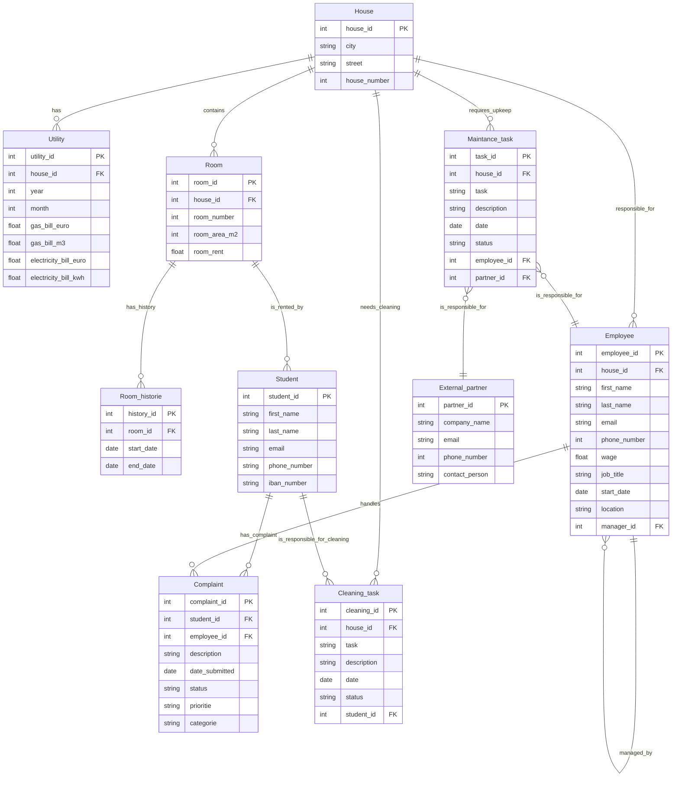

Taakverdeling
Waarvoor maak je deze tabel aan en verbind je niet Student aan de Taak? student - cleaning_Task

Heb alles in het engels gezet, handig om dit aan te als standaard voor je producten (Tip van Bert)

Omgezet naar Mermaid zodat het gitbaar is

Verder wat relaties tegevoegd, veel veranderd