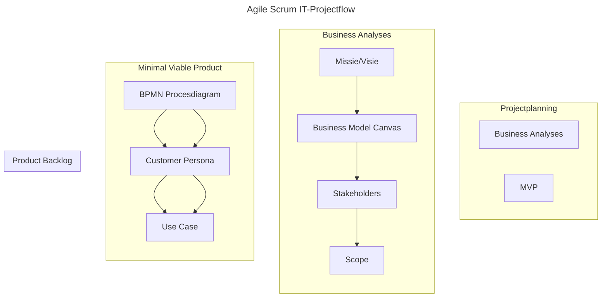
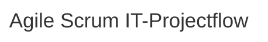

```mermaid
---
title: Agile Scrum IT-Projectflow
---
flowchart TD

    subgraph Projectplanning[Projectplanning]
        direction LR
        PPA[Business Analyses]
        PPB[MVP]
    end
    
	subgraph Business_Analyses[Business Analyses]
		direction TB
		BAA[Missie/Visie]
		BAB[Business Model Canvas]
		BAC[Stakeholders]
		BAD[Scope]

		BAA --> BAB
		BAB --> BAC
		BAC --> BAD
	end
	
	subgraph MVP[Minimal Viable Product]
		direction TB
		MVPA[BPMN Procesdiagram]
		MVPB[Customer Persona]
		MVPC[Use Case]
		
		MVPA --> MVPB
		MVPB --> MVPC
	end
	
	subgraph Product_Backlog[Product Backlog]
		direction TB
		MVPA[BPMN Procesdiagram]
		MVPB[Customer Persona]
		MVPC[Use Case]
		
		MVPA --> MVPB
		MVPB --> MVPC
	end

```

```mermaid
---
title: Agile Scrum IT-Projectflow
---
flowchart TD


```