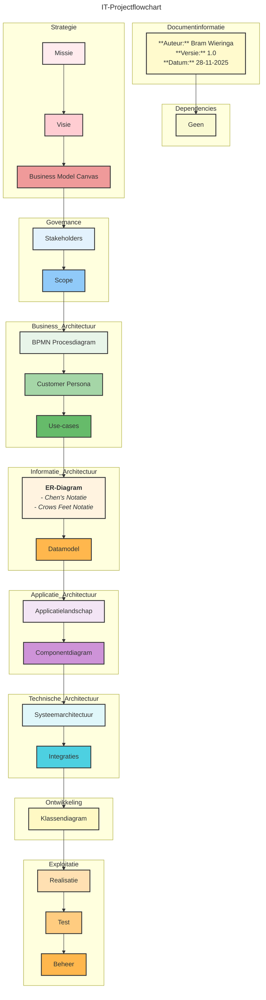

```mermaid
---
title: IT-Projectflowchart
---
flowchart TD

    %% Documentinformatie
    subgraph Documentinformatie
        DOC[**Auteur:** Bram Wieringa<br>**Versie:** 1.0<br>**Datum:** 28-11-2025]
    end
    
    %% Afhankelijkheid
    subgraph Dependencies
        DEP[Geen]
    end

    subgraph Strategie
        A[Missie]
        B[Visie]
        BM[Business Model Canvas]
        A --> B --> BM
    end

    subgraph Governance
        C[Stakeholders]
        D[Scope]
        C --> D
    end

    subgraph Business_Architectuur
        E[BPMN Procesdiagram]
        EE[Customer Persona]
        F[Use-cases]
        E --> EE --> F
    end

    subgraph Informatie_Architectuur
        G["`**ER-Diagram**
	        - _Chen's Notatie_
	        - _Crows Feet Notatie_`"]
	    H[Datamodel]
        G --> H
    end
	
    subgraph Applicatie_Architectuur
        I[Applicatielandschap]
        J[Componentdiagram]
        I --> J
    end

    subgraph Technische_Architectuur
        K[Systeemarchitectuur]
        L[Integraties]
        K --> L
    end

    subgraph Ontwikkeling
        M[Klassendiagram]
    end

    subgraph Exploitatie
        P[Realisatie]
        Q[Test]
        R[Beheer]
        P --> Q --> R
    end

    %% Verbindingen
    BM --> C
    D --> E
    F --> G
    H --> I
    J --> K
    L --> M
    M --> P
    DOC --> DEP

    %% Kleurenprogressie pastel → intens
    style DOC fill:#FFFACD,stroke:#333,stroke-width:2px
    style DEP fill:#FAFAD2,stroke:#333,stroke-width:2px

    style A fill:#FFEBEE,stroke:#333,stroke-width:2px
    style B fill:#FFCDD2,stroke:#333,stroke-width:2px
    style BM fill:#EF9A9A,stroke:#333,stroke-width:2px

    style C fill:#E3F2FD,stroke:#333,stroke-width:2px
    style D fill:#90CAF9,stroke:#333,stroke-width:2px

    style E fill:#E8F5E9,stroke:#333,stroke-width:2px
    style EE fill:#A5D6A7,stroke:#333,stroke-width:2px
    style F fill:#66BB6A,stroke:#333,stroke-width:2px

    style G fill:#FFF3E0,stroke:#333,stroke-width:2px
    style H fill:#FFB74D,stroke:#333,stroke-width:2px

    style I fill:#F3E5F5,stroke:#333,stroke-width:2px
    style J fill:#CE93D8,stroke:#333,stroke-width:2px

    style K fill:#E0F7FA,stroke:#333,stroke-width:2px
    style L fill:#4DD0E1,stroke:#333,stroke-width:2px

    style M fill:#FFF9C4,stroke:#333,stroke-width:2px

    style P fill:#FFE0B2,stroke:#333,stroke-width:2px
    style Q fill:#FFCC80,stroke:#333,stroke-width:2px
    style R fill:#FFB74D,stroke:#333,stroke-width:2px
```