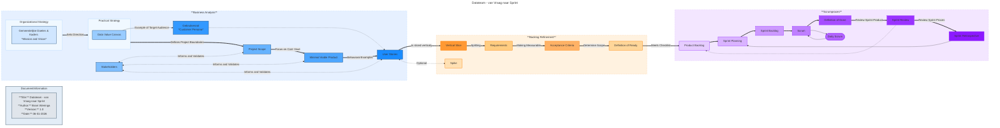

```mermaid
---
title: Datateam - van Vraag naar Sprint
---
flowchart LR

%% Document information
subgraph DocumentInformation
    DOC[**Title:** Datateam - van Vraag naar Sprint<br>**Author:** Bram Wieringa<br>**Version:** 1.0<br>**Date:** 06-01-2026]
end

%% Dependencies
%% subgraph Dependencies
%% end

%% Business Analysis
subgraph businessAnalysis[**Business Analysis**]
direction LR
	subgraph OSTR[Organizational Strategy]
	direction TB
		GDK[Gemeentelijke Doelen & Kaders <br>*Mission and Vision*]
	end
	subgraph PSTR[Practical Strategy]
	direction TB
		DVC[Data Value Canvas]		
	end
	
	STHL[Stakeholders]
	PJSC[Project Scope]
	MVP[Minimal Viable Product]
	CP[Gebruikersrol <br>*Customer Persona*]
	USST[User Stories]

	
	%% Paths
	OSTR ==>|Sets Direction| PSTR ==>|Defines Project Boundaries| PJSC ==>|Focus on Core Vaue| MVP ==>|Behavioral Examples| USST
	STHL <-..->|Informs and Validates| PJSC & MVP & USST
	DVC -->|Example of Target Audience| CP
	
end

%% Backlog Refinement
subgraph backlogRefinement[**Backlog Refinement**]
direction LR
	DOR[Definition of Ready]
	REQ[Requirements]
	ACR[Acceptance Criteria]
	VSLI[Vertical Slice]
	SPIKE[Spike]
end

USST ==>|Is sliced verticaly| VSLI ==>|Splitting| REQ ==>|Making Measurable| ACR ==>|Determine Scope| DOR ==>|Meets Checklist| PB

USST <-.->|Optional| SPIKE

%% Scrumproces
subgraph scrumProces[**Scrumproces**]
direction LR
	PB[Product Backlog]
	SP[Sprint Planning]
	SB[Sprint Backlog]
	SCR[Scrum]
	DAY([Daily Scrum])
	DOD[Definition of Done]
	SR[Sprint Review]
	RET[Sprint Retrospective]

	%% Paths
	SR -.-> PB 
	PB ==> SP ==> SB ==> SCR ==> DOD ==>|Review Sprint Product| SR ==>|Review Sprint Proces| RET --> SP
	DAY --> SCR --> DAY	
end


CP -...-> USST

%% Styles (Door AI)

%% Document & Dependencies - neutraal
style DocumentInformation fill:#E3EDF7,stroke:#5A7184,stroke-width:2px
style DOC fill:#E0E5EB,stroke:#5A7184,stroke-width:2px
%% style Dependencies fill:#E3EDF7,stroke:#5A7184,stroke-width:2px

%% Business Analysis - blauwe familie
style businessAnalysis fill:#E6F0FF,stroke:#99CCFF,stroke-width:1px,stroke-dasharray: 5 5
style OSTR fill:#F0F8FF,stroke:#99CCFF,stroke-width:1px
style PSTR fill:#F0F8FF,stroke:#99CCFF,stroke-width:1px

style GDK fill:#D0E6FF,stroke:#1F4E79,stroke-width:1.5px
style DVC fill:#99CCFF,stroke:#1F4E79,stroke-width:1.5px
style STHL fill:#80BFFF,stroke:#1F4E79,stroke-width:1.5px
style PJSC fill:#66B3FF,stroke:#1F4E79,stroke-width:1.5px
style MVP fill:#4DA6FF,stroke:#1F4E79,stroke-width:1.5px
style CP fill:#3399FF,stroke:#1F4E79,stroke-width:1.5px
style USST fill:#1A8CFF,stroke:#1F4E79,stroke-width:1.5px

%% Backlog Refinement - oranje familie
style backlogRefinement fill:#FFF2E0,stroke:#FFB266,stroke-width:1px,stroke-dasharray: 5 5

style SPIKE fill:#FFE0B3,stroke:#FF8000,stroke-width:1.5px
style DOR fill:#FFD699,stroke:#FF8000,stroke-width:1.5px
style REQ fill:#FFCC80,stroke:#FF8000,stroke-width:1.5px
style ACR fill:#FFB266,stroke:#FF8000,stroke-width:1.5px
style VSLI fill:#FF9933,stroke:#FF8000,stroke-width:1.5px

%% Scrumproces - paars familie
style scrumProces fill:#F3E6FF,stroke:#CC99FF,stroke-width:1px,stroke-dasharray: 5 5

style PB fill:#E6CCFF,stroke:#9933FF,stroke-width:1.5px
style SP fill:#D9B3FF,stroke:#9933FF,stroke-width:1.5px
style SB fill:#CC99FF,stroke:#9933FF,stroke-width:1.5px
style SCR fill:#BF80FF,stroke:#9933FF,stroke-width:1.5px
style DAY fill:#B266FF,stroke:#9933FF,stroke-width:1.5px
style DOD fill:#A64DFF,stroke:#9933FF,stroke-width:1.5px
style SR fill:#9933FF,stroke:#9933FF,stroke-width:1.5px
style RET fill:#8C1AFF,stroke:#9933FF,stroke-width:1.5px 
```