```mermaid
---
title: Van Visie naar Sprint
---
flowchart LR

%% Document information
subgraph DocumentInformation
    DOC[**Title:** Van Visie naar Sprint<br>**Author:** Bram Wieringa<br>**Version:** 3.0<br>**Date:** 10-12-2025]
end

%% Dependencies
subgraph Dependencies
    DEP[Tussentijdse Reflectie op de Samenwerking tijdens de Groepsopdracht - SEM01, Version 1.0<br>]
end

DOC --> DEP

%% Business Analysis
subgraph businessAnalysis[**Business Analysis**]
direction LR
	subgraph OSTR[Organizational Strategy]
	direction TB
		MIS[Mission]
		VIS[Vision]
		
		MIS --> VIS
	end
	subgraph PSTR[Practical Strategy]
	direction TB
		BMC[Business Model Canvas]		
	end
	
	STHL[Stakeholders]
	PJSC[Project Scope]
	MVP[Minimal Viable Product]
	CP[Customer Persona]
	USST[User Stories]

	
	%% Paths
	OSTR ==> PSTR ==> PJSC ==> MVP ==> USST
	STHL <-..-> PJSC & MVP & USST
	BMC --> CP
	CP -...-> USST
	
end

%% Backlog Refinement
subgraph backlogRefinement[**Backlog Refinement**]
direction LR
	DOR[Definition of Ready]
	EST[Story Point Estimation]
	REQ[Requirements]
	ACR[Acceptance Criteria]
	VSLI[Vertical Slice]
	SPIKE[Spike]
	
	%% Paths
	USST ==> VSLI ==> REQ ==> ACR ==> EST ==> DOR
	USST <-.->|Optional| SPIKE
	
end

%% Scrumproces
subgraph scrumProces[**Scrumproces**]
direction LR
	PB[Product Backlog]
	SP[Sprint Planning]
	SB[Sprint Backlog]
	SCR[Scrum]
	DAY([Daily Scrum])
	DOD[Definition of Done]
	SR[Sprint Review]
	SRS[Sprint Retrospective]

	%% Paths
	DOR ==> PB ==> SP ==> SB ==> SCR ==> DOD ==> SR ==> SRS
	DAY --> SCR --> DAY
	
	SRS -.->|Reflection Proces| SP
	SR -.->|Reflection Product| PB
	
end

%% Comments (CC)
VSLICC01(["`
**Example**
**Slice 1: Basic Login**
The user can log in with a fixed *hardcoded* user. 
UI -> Basic Logic -> Dummy Database Read Function
<br>
**Slice 2: Real Validation**
The user can log in with valid credentials from the database.
UI -> Basic Logic -> Real Database Read Function
<br>
**Slice 3: Error Handling**
The user sees the correct error messages for incorrect input.
UI -> Logic -> Feedback
<br>
**Slice 4: Forgot Password**
The user can receive a 'forgot password' email.
UI -> Logic -> Email Service
`"])

REQCC01(["`
**Functional Requirements** 
What should the user be able to do? 
Which calculation should the system be able to perform? 
Which data should the system manage? 
<br> 
**Non-Functional Requirements** 
**Performance**, load within 3 seconds with 1000 concurrent clicks 
**Security**, all personal data must be stored encrypted 
**Scalability**, system must be able to handle 5x current transaction volume without downtime 
**Usability**, easy to navigate (e.g., maximum 3 clicks to complete a transaction)
`"])

ACRCC01(["`
**Examples:**
**Succes Path**
GIVEN: The user is viewing a product page with stock available (e.g., 5 items).
WHEN: The user clicks the 'Add to Cart' button once.
THEN: The cart icon shows '1 item' AND the stock level for the product is updated to 4.
<br>
**Error Path 01**
GIVEN: The user is viewing a product page where the stock is zero (0).
WHEN: The user clicks the 'Add to Cart' button.
THEN: The 'Add to Cart' button is disabled (or grayed out) AND an 'Out of Stock' message is displayed.
<br>
**Error Path 02**
GIVEN: The user is logged out.
WHEN: The user adds an item to the cart.
THEN: The item is successfully added to the cart AND the cart content persists when the user logs in later.
`"])

ESTCC01(["`
Imagine you have a pile of LEGO sets to build. Some sets are small, some are big.
<br>
-Story points are numbers that show how hard or big each LEGO set is.
--Tiny LEGO car -> 1 point 
--Big LEGO castle -> 8 points
<br>
Now, to make sure the numbers are fair:
<br>
-The team can choose one LEGO set as a “reference castle”. 
-This reference castle gets a fixed story point number (like 5 points).
-Every new set is compared to the reference castle:
--If its easier -> smaller number
--If its harder -> bigger number
<br>
This helps the team estimate consistently and avoid inflating numbers.
`"])

DORCC01(["`
**I. Clarity & Value**
**User Story**
Is the Story formulated in the format 'As a [Role], I want [Goal], so that [Reason]'?
<br>
**Acceptance Criteria**
Are the Acceptance Criteria (test scenarios, e.g., GIVEN/WHEN/THEN) complete and clear?
<br>
**Vertical Slice**
Is the Story a Vertical Slice (delivers end-to-end value) and not a horizontal layer (database only)?
<br>
**II. Size & Estimation**
**Estimated**
Has the Development Team provided a Story Point Estimation (EST)?
<br>
**Sized**
Is the Story small enough to be completed within one Sprint? (If not, return to splitting).
<br>
**Dependencies**
Are all external dependencies (other teams, APIs) known and is the risk manageable?
<br>
**III. Technical Readiness**
**Design**
Are high-level sketches (e.g., of the database impact/ERD Chens) available to determine the technical approach?
<br>
**NFRs**
Are all critical Non-Functional Requirements (NFRs) for this Story known and addressed?
<br>
**UX/UI**
Is the design or are the wireframes available for the feature to be built?
`"])

DODCC01(["`
**Example**
-the functionality fully works according to the user story
-the code has been tested
-documentation in GitHub has been updated
-the reviewer has approved it
-the functionality can be demonstrated in the sprint review
`"])

SPIKECC01(["`
A Scrum Spike is a moment when the team takes some time to figure out how something works before they really start building it.  
They are not building the real thing yet, they are just trying and learning first.
<br>
It is like this:
*You want to build a big tower with blocks, but you don’t know if the blocks are strong enough.*
*So you first build a small test tower to see if it works. That little test is the **Spike**.*
<br>
With a Spike, the team tries to:
-find out if something is possible
-learn how to build it
-and discover the best way to do it
<br>
This way, they make fewer mistakes later, and they know better what to do when they start the real work.
<br>
In short:
A Scrum Spike is a short learning time to build smarter later.
`"])

SRCC01(["`
**What did we build**
What has been delivered during this sprint?
Does the result meet the expectations of the stakeholders / Product Owner?
Is it usable, working, and valuable?
Any feedback on the product itself.
Input for updating the product backlog.
`"])

SRSCC01(["`
**How did we collaborate and work?**
How did the collaboration go?
What went well and what went less well?
Which bottlenecks were there in the process?
What will we concretely improve in the next sprint?
`"])

PBCC01(["`
**Tasks**
Add tasks to the vertical slice.
Front-end
Back-end
Database
Test/QA
`"])

%% Paths Comments
VSLI -.- VSLICC01
REQ -.- REQCC01
ACR -.- ACRCC01
DOR -.- DORCC01
EST -.- ESTCC01
SPIKE -.- SPIKECC01
DOD -.- DODCC01
SR -.- SRCC01
SRS -.- SRSCC01
PB -.- PBCC01


%% Styles (By Chat-GPT)

%% Document & Dependencies
style DocumentInformation fill:#E3EDF7,stroke:#5A7184,stroke-width:2px
style DOC fill:#E0E5EB,stroke:#5A7184,stroke-width:2px
style Dependencies fill:#E3EDF7,stroke:#5A7184,stroke-width:2px
style DEP fill:#E0E5EB,stroke:#5A7184,stroke-width:2px

%% Business Analysis - blauw familie
style businessAnalysis fill:#E6F0FF,stroke:#99CCFF,stroke-width:1px,stroke-dasharray: 5 5
style OSTR fill:#F0F8FF,stroke:#99CCFF,stroke-width:1px
style PSTR fill:#F0F8FF,stroke:#99CCFF,stroke-width:1px
style MIS fill:#D0E6FF,stroke:#1F4E79,stroke-width:1.5px
style VIS fill:#B3D9FF,stroke:#1F4E79,stroke-width:1.5px
style BMC fill:#99CCFF,stroke:#1F4E79,stroke-width:1.5px
style STHL fill:#80BFFF,stroke:#1F4E79,stroke-width:1.5px
style PJSC fill:#66B3FF,stroke:#1F4E79,stroke-width:1.5px
style MVP fill:#4DA6FF,stroke:#1F4E79,stroke-width:1.5px
style CP fill:#3399FF,stroke:#1F4E79,stroke-width:1.5px
style USST fill:#1A8CFF,stroke:#1F4E79,stroke-width:1.5px

%% Backlog Refinement - oranje familie
style backlogRefinement fill:#FFF2E0,stroke:#FFB266,stroke-width:1px,stroke-dasharray: 5 5
style SPIKE fill:#FFE0B3,stroke:#FF8000,stroke-width:1.5px
style DOR fill:#FFD699,stroke:#FF8000,stroke-width:1.5px
style REQ fill:#FFCC80,stroke:#FF8000,stroke-width:1.5px
style ACR fill:#FFB266,stroke:#FF8000,stroke-width:1.5px
style VSLI fill:#FF9933,stroke:#FF8000,stroke-width:1.5px

%% Scrumproces - paars familie
style scrumProces fill:#F3E6FF,stroke:#CC99FF,stroke-width:1px,stroke-dasharray: 5 5
style PB fill:#E6CCFF,stroke:#9933FF,stroke-width:1.5px
style SP fill:#D9B3FF,stroke:#9933FF,stroke-width:1.5px
style SB fill:#CC99FF,stroke:#9933FF,stroke-width:1.5px
style SCR fill:#BF80FF,stroke:#9933FF,stroke-width:1.5px
style DAY fill:#B266FF,stroke:#9933FF,stroke-width:1.5px
style DOD fill:#A64DFF,stroke:#9933FF,stroke-width:1.5px
style SR fill:#9933FF,stroke:#9933FF,stroke-width:1.5px
style SRS fill:#C299FF,stroke:#9933FF,stroke-width:1.5px
style EST fill:#FFB266,stroke:#FF8000,stroke-width:1.5px

%% Comments - lichtere tinten van parent
style VSLICC01 fill:#FFEFD5,stroke:#FF9933,stroke-width:1.5px,stroke-dasharray: 3 3
style REQCC01 fill:#FFF5E6,stroke:#FF9933,stroke-width:1.5px,stroke-dasharray: 3 3
style ACRCC01 fill:#FFE6CC,stroke:#FF9933,stroke-width:1.5px,stroke-dasharray: 3 3
style ESTCC01 fill:#FFF0CC,stroke:#FF9933,stroke-width:1.5px,stroke-dasharray: 3 3
style DORCC01 fill:#FFE6B3,stroke:#FF9933,stroke-width:1.5px,stroke-dasharray: 3 3
style SPIKECC01 fill:#FFF2CC,stroke:#FF9933,stroke-width:1.5px,stroke-dasharray: 3 3
style DODCC01 fill:#E0CCFF,stroke:#9933FF,stroke-width:1.5px,stroke-dasharray: 3 3
style SRCC01 fill:#E6CCFF,stroke:#9933FF,stroke-width:1.5px,stroke-dasharray: 3 3
style SRSCC01 fill:#EAD1FF,stroke:#9933FF,stroke-width:1.5px,stroke-dasharray: 3 3
```

%%
10-12-2025
https://docs.google.com/document/u/0/d/1TCuuu-8Mm14oxsOnlk8DqfZAA1cvtYu9WGv67Yj_sSk/pub?pli=1

https://docs.google.com/document/u/0/d/1TCuuu-8Mm14oxsOnlk8DqfZAA1cvtYu9WGv67Yj_sSk/pub?pli=1

https://www.youtube.com/watch?v=-mZO9aASfQA

%%