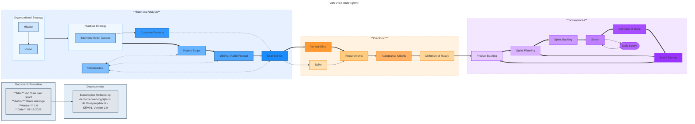

```mermaid
---
title: Van Visie naar Sprint
---
flowchart LR

%% Document information
subgraph DocumentInformation
    DOC[**Title:** Van Visie naar Sprint<br>**Author:** Bram Wieringa<br>**Version:** 1.0<br>**Date:** 07-12-2025]
end

%% Dependencies
subgraph Dependencies
    DEP[Tussentijdse Reflectie op de Samenwerking tijdens de Groepsopdracht - SEM01, Version 1.0<br>]
end

DOC --> DEP

%% Business Analysis
subgraph businessAnalysis[**Business Analysis**]
direction LR
	subgraph OSTR[Organizational Strategy]
	direction TB
		MIS[Mission]
		VIS[Vision]
		
		MIS --> VIS
	end
	subgraph PSTR[Practical Strategy]
	direction TB
		BMC[Business Model Canvas]		
	end
	
	STHL[Stakeholders]
	PJSC[Project Scope]
	MVP[Minimal Viable Product]
	CP[Customer Persona]
	USST[User Stories]

	
	%% Paths
	OSTR ==> PSTR ==> PJSC ==> MVP ==> USST
	STHL <-..-> PJSC & MVP & USST
	BMC --> CP
	
end

%% Pre-Scrum
subgraph preScrum[**Pre-Scrum**]
direction LR
	SPIKE[Spike]
	DOR[Definition of Ready]
	REQ[Requirements]
	ACR[Acceptance Criteria]
	VSLI[Vertical Slice]
end

USST ==> VSLI ==> REQ ==> ACR ==> DOR ==> PB
USST --> SPIKE --> REQ

%% Scrumproces
subgraph scrumProces[**Scrumproces**]
direction LR
	PB[Product Backlog]
	SP[Sprint Planning]
	SB[Sprint Backlog]
	SCR[Scrum]
	DAY([Daily Scrum])
	DOD[Definition of Done]
	SR[Sprint Review]

	%% Paths
	PB ==> SP ==> SB ==> SCR ==> DOD ==> SR
	DAY --> SCR --> DAY
	
	SR ==> SP
	SR ==> PB
end

CP -...-> USST

%% Styles (Door CHAT-GPT)

%% Document & Dependencies - neutraal
style DocumentInformation fill:#E3EDF7,stroke:#5A7184,stroke-width:2px
style DOC fill:#E0E5EB,stroke:#5A7184,stroke-width:2px
style Dependencies fill:#E3EDF7,stroke:#5A7184,stroke-width:2px
style DEP fill:#E0E5EB,stroke:#5A7184,stroke-width:2px

%% Business Analysis - blauwe familie
style businessAnalysis fill:#E6F0FF,stroke:#99CCFF,stroke-width:1px,stroke-dasharray: 5 5
style OSTR fill:#F0F8FF,stroke:#99CCFF,stroke-width:1px
style PSTR fill:#F0F8FF,stroke:#99CCFF,stroke-width:1px

style MIS fill:#D0E6FF,stroke:#1F4E79,stroke-width:1.5px
style VIS fill:#B3D9FF,stroke:#1F4E79,stroke-width:1.5px
style BMC fill:#99CCFF,stroke:#1F4E79,stroke-width:1.5px
style STHL fill:#80BFFF,stroke:#1F4E79,stroke-width:1.5px
style PJSC fill:#66B3FF,stroke:#1F4E79,stroke-width:1.5px
style MVP fill:#4DA6FF,stroke:#1F4E79,stroke-width:1.5px
style CP fill:#3399FF,stroke:#1F4E79,stroke-width:1.5px
style USST fill:#1A8CFF,stroke:#1F4E79,stroke-width:1.5px

%% Pre-Scrum - oranje familie
style preScrum fill:#FFF2E0,stroke:#FFB266,stroke-width:1px,stroke-dasharray: 5 5

style SPIKE fill:#FFE0B3,stroke:#FF8000,stroke-width:1.5px
style DOR fill:#FFD699,stroke:#FF8000,stroke-width:1.5px
style REQ fill:#FFCC80,stroke:#FF8000,stroke-width:1.5px
style ACR fill:#FFB266,stroke:#FF8000,stroke-width:1.5px
style VSLI fill:#FF9933,stroke:#FF8000,stroke-width:1.5px

%% Scrumproces - paars familie
style scrumProces fill:#F3E6FF,stroke:#CC99FF,stroke-width:1px,stroke-dasharray: 5 5

style PB fill:#E6CCFF,stroke:#9933FF,stroke-width:1.5px
style SP fill:#D9B3FF,stroke:#9933FF,stroke-width:1.5px
style SB fill:#CC99FF,stroke:#9933FF,stroke-width:1.5px
style SCR fill:#BF80FF,stroke:#9933FF,stroke-width:1.5px
style DAY fill:#B266FF,stroke:#9933FF,stroke-width:1.5px
style DOD fill:#A64DFF,stroke:#9933FF,stroke-width:1.5px
style SR fill:#9933FF,stroke:#9933FF,stroke-width:1.5px
```