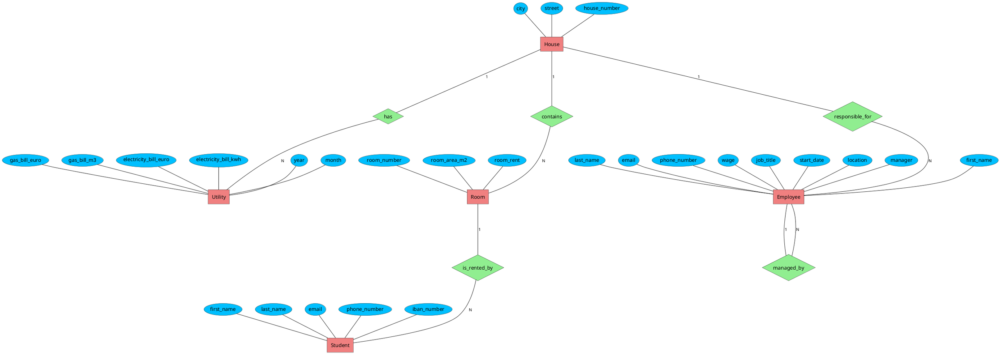

```plantuml
@startchen
<style>
.red {
BackGroundColor #f08080
FontColor #000000
}
.blue {
BackGroundColor #00bfff
FontColor #000000
}
.green {
BackGroundColor #90ee90
FontColor #000000
}
</style>

' Entities
entity Utility <<red>> {
	year <<blue>> {
	}
	month <<blue>> {
	}
	gas_bill_euro <<blue>> {
	}
	gas_bill_m3 <<blue>> {
	}
	electricity_bill_euro <<blue>> {
	}
	electricity_bill_kwh <<blue>> {
	}
}

entity House <<red>> {
	city <<blue>> {
	}
	street <<blue>> {
	}
	house_number <<blue>> {
	}
}

entity Room <<red>> {
	room_number <<blue>> {
	}
	room_area_m2 <<blue>> {
	}
	room_rent <<blue>> {
	}
}

entity Student <<red>> {
	first_name <<blue>> {
	}
	last_name <<blue>> {
	}
	email <<blue>> {
	}
	phone_number <<blue>> {
	}
	iban_number <<blue>> {
	}
}

entity Employee <<red>> {
	first_name <<blue>> {
	}
	last_name <<blue>> {
	}
	email <<blue>> {
	}
	phone_number <<blue>> {
	}
	wage <<blue>> {
	}
	job_title <<blue>> {
	}
	start_date <<blue>> {
	}
	location <<blue>> {
	}
	manager <<blue>> {
	}
}

' Relationships

relationship has <<green>> {
}
relationship contains <<green>> {
}
relationship is_rented_by <<green>> {
}
relationship responsible_for <<green>> {
}
relationship managed_by <<green>> {
}

' connection
House -1- has
has -N- Utility

House -1- responsible_for
responsible_for -N- Employee

House -1- contains
contains -N- Room

Room -1- is_rented_by
is_rented_by -N- Student

Employee -1- managed_by
managed_by -N- Employee

@endchen
```