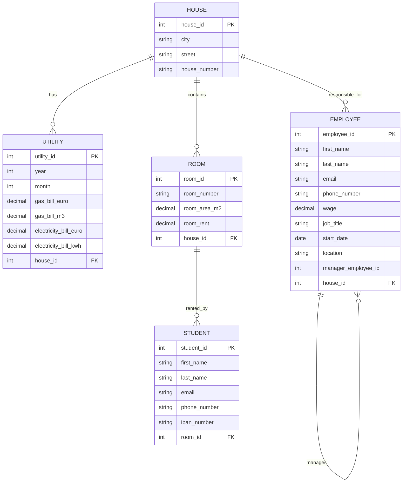

```mermaid
erDiagram
    UTILITY {
        int utility_id PK
        int year
        int month
        decimal gas_bill_euro
        decimal gas_bill_m3
        decimal electricity_bill_euro
        decimal electricity_bill_kwh
        int house_id FK
    }

    HOUSE {
        int house_id PK
        string city
        string street
        string house_number
    }

    ROOM {
        int room_id PK
        string room_number
        decimal room_area_m2
        decimal room_rent
        int house_id FK
    }

    STUDENT {
        int student_id PK
        string first_name
        string last_name
        string email
        string phone_number
        string iban_number
        int room_id FK
    }

    EMPLOYEE {
        int employee_id PK
        string first_name
        string last_name
        string email
        string phone_number
        decimal wage
        string job_title
        date start_date
        string location
        int manager_employee_id
        int house_id FK
    }

    HOUSE ||--o{ UTILITY : has
    HOUSE ||--o{ ROOM : contains
    HOUSE ||--o{ EMPLOYEE : responsible_for
    ROOM ||--o{ STUDENT : rented_by
    EMPLOYEE ||--o{ EMPLOYEE : manages
```
