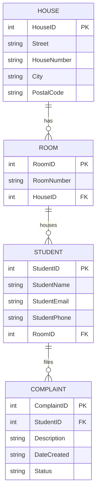

```mermaid
erDiagram

    HOUSE {
        int HouseID PK
        string Street
        string HouseNumber
        string City
        string PostalCode
    }

    ROOM {
        int RoomID PK
        string RoomNumber
        int HouseID FK
    }

    STUDENT {
        int StudentID PK
        string StudentName
        string StudentEmail
        string StudentPhone
        int RoomID FK
    }

    COMPLAINT {
        int ComplaintID PK
        int StudentID FK
        string Description
        string DateCreated
        string Status
    }

    HOUSE ||--o{ ROOM : has
    ROOM ||--o{ STUDENT : houses
    STUDENT ||--o{ COMPLAINT : files
```
