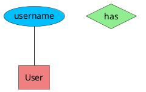
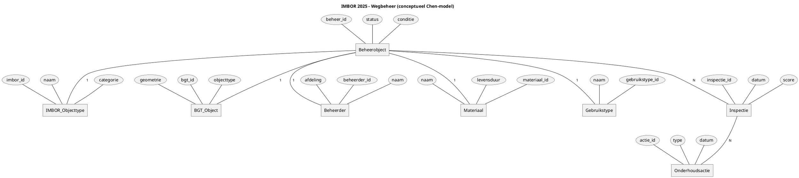

Relevanten vakken gaan we uitwerken wat relevanten waarden zijn, zodat we de vervuiling eruit kunnen halen.

```mermaid

erDiagram
    Wegonderdeel {
            string objectnr "Onderdeelnr | weg"
            string datum "Datum_Mutatie | Marco; weg of blijven?"
            string tijd "Tijd mutatie | Marco; weg of blijven?"
            string status "Status functioneren | weg"
            string wv_begin "Wegvak begin | Marco; is dit relevant?"
            string wv_eind "Wegvak eind | Marco; is dit relevant?"
            string totenmet "Tot en met 0/1 | weg"
            string wegvaknaam "Wegvaknaam | Marco; is dit relevant?"
            string wegfunctie "Wegunctie | Marco; is dit relevant?"
            string wegtype ""
            string onderdeel
            string verh_type
            string verh_soort
            string const_klas
            string verh_const
            string voegconstr
            string voeglengte
            string jva
            string jvr
            string lengte
            string breedte
            string oppervlak
            string x_coord
            string y_coord
            string peil_mv
            string opmerking
            string bor_guid
            string ingeo_guid
            string begindatum
            string einddatum
            string bhg_code
            string bhg_naam
            string objgroep
            string buurtwijk
            string straatcode
            string plaats
            string straatnaam
            string huisnummer
            string eigenaar
            string beheerder
            string leverancie
            string klokstand
            string kenmerk_0
            string kenmerk_1
            string kenmerk_2
            string kenmerk_3
            string kenmerk_4
            string kenmerk_5
            string kenmerk_6
            string kenmerk_7
            string kenmerk_8
            string kenmerk_9
            string entiteit
            string bgtfunctie
            string bgttype
            string bgtfysiek
            string plsfunctie
            string plsfysiek
            string insp_datum
            string rafeling
            string rafeling_z
            string dwarsonvlk
            string dwarsonv_e
            string oneffenhed
            string oneffenh_e
            string oneffenh_c
            string scheurvorm
            string scheurvo_c
            string randschade
            string voegvullng
            string voegwijdte
            string zetting
            string onkruid
            string dekking
            string insp_opm
            string datum_insp
            string conditie
            string c_aspect
            string c_waarde1
            string c_waarde2
            string c_foto
            string c_opmerkng
            string c_aspect1
            string c_aspect2
            string c_aspect3
            string c_aspect4
            string c_aspect5
            string c_aspect6
            string c_aspect7
            string c_aspect8
            string c_aspect9
            string c_aspect10
            string c_aspect11
            string c_aspect12
            string datum_uitv
            string datum_plan
            string min_jaar
            string max_jaar
            string krs_mtrgl
            string krs_kost
            string plan_naam
            string plan_jaar
            string plan_code
            string plan_mtrgl
            string plan_stats
            string plan_artcl
            string plan_kost
            string mtr_naam
            string mtr_jaar
            string mtr_code
            string mtr_mtrgl
            
        }

    Inspectie {
            string name
            string custNumber
            string sector
        }

```

```plantuml
@startchen
<style>
.red {
BackGroundColor #f08080
FontColor #000000
}
.blue {
BackGroundColor #00bfff
FontColor #000000
}
.green {
BackGroundColor #90ee90
FontColor #000000
}
</style>

' Entiteiten
entity User <<red>> {
	username <<blue>> {
	}
}

' relationship
relationship has <<green>> {
}

' connection
'User -1- has
'has -N- Session

@endchen
```

```plantuml
@startchen
title IMBOR 2025 – Wegbeheer (conceptueel Chen-model)

entity IMBOR_Objecttype {
    imbor_id
    naam
    categorie
}

entity BGT_Object {
    bgt_id
    objecttype
    geometrie
}

entity Beheerobject {
    beheer_id
    status
    conditie
}

entity Beheerder {
    beheerder_id
    naam
    afdeling
}

entity Materiaal {
    materiaal_id
    naam
    levensduur
}

entity Gebruikstype {
    gebruikstype_id
    naam
}

entity Inspectie {
    inspectie_id
    datum
    score
}

entity Onderhoudsactie {
    actie_id
    type
    datum
}

Beheerobject -1- BGT_Object 
Beheerobject -1- IMBOR_Objecttype
Beheerobject -1- Materiaal
Beheerobject -1- Gebruikstype
Beheerobject -1- Beheerder
Beheerobject -N- Inspectie
Inspectie -N- Onderhoudsactie

@endchen
```