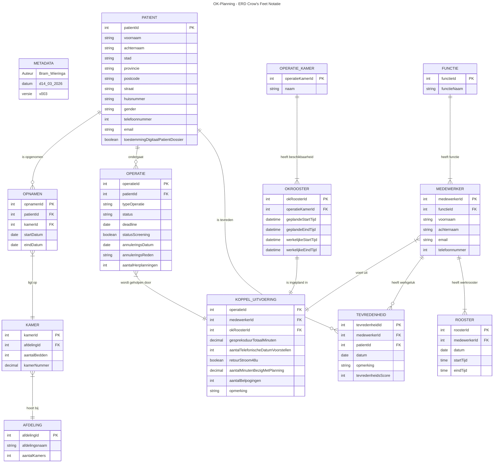

```mermaid
---
title: OK-Planning - ERD Crow's Feet Notatie
---
erDiagram
    METADATA {
    Auteur Bram_Wieringa
    datum d14_03_2026
    versie v003
    }
    
    PATIENT ||--o{ OPNAMEN : "is opgenomen"
    OPNAMEN }|--|| KAMER : "ligt op"
    KAMER }|--|| AFDELING : "hoort bij"
    
    PATIENT ||--o{ OPERATIE : ondergaat
    MEDEWERKER }|--|| KOPPEL_UITVOERING : "voert uit"
    OPERATIE }|--|| KOPPEL_UITVOERING : "wordt geholpen door"
    OKROOSTER ||--|| KOPPEL_UITVOERING : "is ingepland in"
    
    MEDEWERKER ||--o{ TEVREDENHEID : "heeft werkgeluk"
    PATIENT ||--o{ TEVREDENHEID : "is tevreden"
    
    MEDEWERKER ||--|{ ROOSTER : "heeft werkrooster"
    FUNCTIE ||--|{ MEDEWERKER : "heeft functie"
    
    OPERATIE_KAMER ||--|{ OKROOSTER : "heeft beschikbaarheid"
    
    PATIENT {
    int patientId PK
    string voornaam
    string achternaam
    string stad
    string provincie
    string postcode
    string straat
    string huisnummer
    string gender
    int telefoonnummer
    string email
    boolean toestemmingDigitaalPatientDossier
    }
    
    OPNAMEN {
    int opnamenId PK
    int patientId FK
    int kamerId FK
    date startDatum
    date eindDatum
    }
    
    KAMER {
    int kamerId PK
    int afdelingId FK
    int aantalBedden
    decimal kamerNummer
    }
    
    AFDELING {
    int afdelingId PK
    string afdelingsnaam
    int aantalKamers
    }
    
    MEDEWERKER {
    int medewerkerId PK
    int functieId FK
    string voornaam
    string achternaam
    string email
    int telefoonnummer
    }
    
    FUNCTIE {
    int functieId PK
    string functieNaam
    }
    
    ROOSTER {
    int roosterId PK
    int medewerkerId FK
    date datum
    time startTijd
    time eindTijd
    }
    
    TEVREDENHEID{
    int tevredenheidId PK
    int medewerkerId FK
    int patientId FK
    date datum
    string opmerking
    int tevredenheidsScore
    }
    
    OPERATIE {
    int operatieId PK
    int patientId FK
    string typeOperatie
    string status
    date deadline
    boolean statusScreening
    date annuleringsDatum
    string annuleringsReden
    int aantalHerplanningen
    }
    
    OKROOSTER {
    int okRoosterId PK
    int operatieKamerId FK
    datetime geplandeStartTijd
    datetime geplandeEindTijd
    datetime werkelijkeStartTijd
    datetime werkelijkeEindTijd
    }
    
    OPERATIE_KAMER {
    int operatieKamerId PK
    string naam
    }
    
    KOPPEL_UITVOERING {
    int operatieId FK
    int medewerkerId FK
    int okRoosterId FK
    decimal gespreksduurTotaalMinuten
    int aantalTelefonischeDatumVoorstellen
    boolean retourStroom48u
    decimal aantalMinutenBezigMetPlanning
    int aantalBelpogingen
    string opmerking
    }
    
    %% Eén-op-één relaties
    %% A ||--|| B : "Precies 1 op Precies 1"
    %% A ||--o| C : "Precies 1 op 0 of 1"
    %% Eén-op-veel relaties
    %% D ||--|{ E : "Precies 1 op 1 of meer"
    %% F ||--o{ G : "Precies 1 op 0 of meer"
    %% Veel-op-veel (of optionele) relaties
    %% H }|--|{ I : "1 of meer op 1 of meer"
    %% J }o--o{ K : "0 of meer op 0 of meer"
    %% L }o--o| M : "0 of meer op 0 of 1"
```