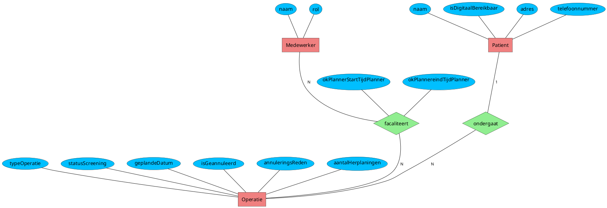

```plantuml
@startchen
<style>
.red {
BackGroundColor #f08080
FontColor #000000
}
.blue {
BackGroundColor #00bfff
FontColor #000000
}
.green {
BackGroundColor #90ee90
FontColor #000000
}
</style>

' Entities
entity Patient <<red>> {
	naam <<blue>> {
	}
	isDigitaalBereikbaar <<blue>> {
	}
	adres <<blue>> {
	}
	telefoonnummer <<blue>> {
	}
}

entity Operatie <<red>> {
	typeOperatie <<blue>> {
	}
	statusScreening <<blue>> {
	}
	geplandeDatum <<blue>> {
	}
	isGeannuleerd <<blue>> {
	}
	annuleringsReden <<blue>> {
	}
	aantalHerplaningen <<blue>> {
	}
}

entity Medewerker <<red>> {
	naam <<blue>> {
	}
	rol <<blue>> {
	}
}

' Relationships
relationship ondergaat <<green>> {
}

Patient -1- ondergaat
ondergaat -N- Operatie

relationship facaliteert <<green>> {
	okPlannerStartTijdPlanner <<blue>> {
	}
	okPlannereindTijdPlanner <<blue>> {
	}

}

Medewerker -N- facaliteert
facaliteert -N- Operatie

@endchen
```