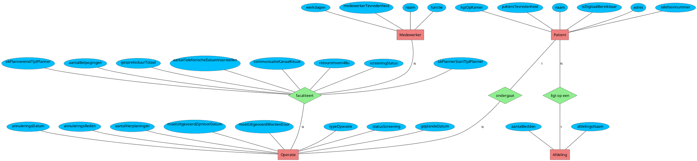

```plantuml
@startchen
<style>
.red {
BackGroundColor #f08080
FontColor #000000
}
.blue {
BackGroundColor #00bfff
FontColor #000000
}
.green {
BackGroundColor #90ee90
FontColor #000000
}
</style>

' Entities
entity Patient <<red>> {
	' Kwalitatief voor identificatie
	naam <<blue>> {
	}
	' 4.2 Responsiviteit & Kanaalkeuze
	isDigitaalBereikbaar <<blue>> {
	}
	' 4.2 Responsiviteit & Kanaalkeuze
	adres <<blue>> {
	}
	' 4.2 Responsiviteit & Kanaalkeuze & 4.2 Klantcontacttijd
	telefoonnummer <<blue>> {
	}
	ligtOpKamer <<blue>>{
	}
	patientTevredenheid <<blue>> {
	}
}

entity Operatie <<red>> {
	' Algemeen proces
	typeOperatie <<blue>> {
	}
	' 4.3 Screening "In-Control" ratio
	statusScreening <<blue>> {
	}
	' 4.1 Operationele Efficiency
	geplandeDatum <<blue>> {
	}
	' 4.1 Annuleringen beddentekort
	annuleringsDatum <<blue>> {
	}
	' 4.1 Annuleringen beddentekort
	annuleringsReden <<blue>> {
	}
	' 4.2 Escalatie en processtagnatie (Deadlocks)
	aantalHerplaningen <<blue>> {
	}
	' Algemeen proces - hier geeft arts termijn aan voor operatie
	moetUitgevoerdZijnVoorDatum <<blue>> {
	}
	' Algemeen proces, weten door welke arts(en) operatie moet worden uitgevoerd
	moetUitgevoerdWordenDoor <<blue>> {
	}
}

entity Medewerker <<red>> {
	' Algemene identificatie
	naam <<blue>> {
	}
	' functie
	functie <<blue>> {
	}
	' beschikbare werkdagen
	werkdagen <<blue>> {
	}
	medewerkerTevredenheid <<blue>> {
	}
}

entity Afdeling <<red>> {
	afdelingsNaam <<blue>> {
	}
	aantalBedden <<blue>> {
	}
}

' Relationships
relationship ondergaat <<green>> {
}

Patient -1- ondergaat
ondergaat -N- Operatie

relationship facaliteert <<green>> {
	' 4.1 Gemiddelde doorlooptijd
	okPlannerStartTijdPlanner <<blue>> {
	}
	' 4.1 Gemiddelde doorlooptijd
	okPlannereindTijdPlanner <<blue>> {
	}
	' 4.2 Responsiviteit en kanaalkeuze Indicator B
	aantalBelpogingen <<blue>> {
	}
	' 4.2 Klantcontacttijd (Gespreksduur)
	gespreksduurTotaal <<blue>> {
	}
	' 4.2 Responsiviteit en kanaalkeuze Indicator A
	aantalTelefonischeDatumVoorstellen <<blue>> {
	}
	' 4.2 Responsiviteit welke kanaal voor bereikbaarheid is gekozen
	communicatieKanaalKeuze <<blue>> {
	}
	' 4.2 Retourstroom na digitaal contact - nam patient binnen 48u contact op
	retourstroom48u <<blue>> {
	}
	screeningStatus <<blue>> {
	}
}

Medewerker -N- facaliteert
facaliteert -N- Operatie

relationship "ligt op een" as ligtOpEen <<green>> {
} 

Patient -N- ligtOpEen
ligtOpEen -1- Afdeling

@endchen
```