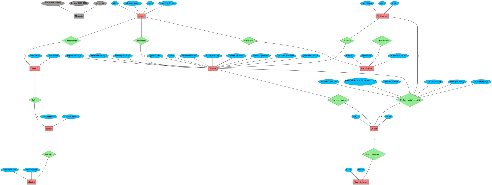

```plantuml
@startchen
<style>
.red {
BackGroundColor #f08080
FontColor #000000
}
.blue {
BackGroundColor #00bfff
FontColor #000000
}
.green {
BackGroundColor #90ee90
FontColor #000000
}
.grey {
BackGroundColor #9C9594
FontColor #000000
}
</style>

' Metadata
entity Metadata <<grey>> {
	"Auteur: Bram Wieringa" as auteur <<grey>> {
	}
	"Datum: 05-03-2026" as datumvandaag <<grey>> {
	}
	"Versie: 002" as versie <<grey>> {
	}
}

' Entities
entity Patient <<red>> {
	naam <<blue>> {
	}
	voorkeurskanaal <<blue>> {
	' e-mail, patientenportaal, SMS, telefoon, Post
	}
	adres <<blue>> {
	}
	telefoonnummer <<blue>> {
	}
}

entity Opnamen <<red>> {
	startDatum <<blue>> {
	}
	eindDatum <<blue>> {
	}
}

entity Kamer <<red>> {
	kamerNummer <<blue>> {
	}
	aantalBedden <<blue>> {
	}
}

entity Tevredenheid <<red>> {
	tevredenheidsScore <<blue>> {
	}
	datetime <<blue>> {
	}
	opmerking <<blue>> {
	}
}

entity Operatie <<red>> {
	typeOperatie <<blue>> {
	}
	status <<blue>> {
	' ingepland, uitgevoerd, geannuleerd
	}
	deadlineOperatie <<blue>> {
	}
	statusScreening <<blue>> {
	}
	annuleringsDatum <<blue>> {
	}
	annuleringsReden <<blue>> {
	}
	aantalHerplaningen <<blue>> {
	}
	geplandeStartTijd <<blue>> {
	}
	geplandeEindTijd <<blue>> {
	}
	werkelijkeStartTijd <<blue>> {
	}
	werkelijkeEindTijd <<blue>> {
	}
}

entity Medewerker <<red>> {
	naam <<blue>> {
	}
	functie <<blue>> {
	}
	werkdagen <<blue>> {
	}
}

entity Afdeling <<red>> {
	afdelingsNaam <<blue>> {
	}
	aantalKamers <<blue>> {
	}
}

entity "Operatie Kamer" as OK <<red>> {
	naam <<blue>> {
	}
	locatie <<blue>> {
	}
}

entity "OK-slot" as OKSlot <<red>> {
	datum <<blue>> {
	}
	tijdslot <<blue>> {
	}
}

' Relationships

relationship "OK-slots worden geplant" as plant <<green>> {
	startTijdPlanning <<blue>> {
	}
	eindTijdPlanning <<blue>> {
	}
	aantalBelpogingen <<blue>> {
	}
	gespreksduurTotaal <<blue>> {
	}
	aantalTelefonischeDatumVoorstellen <<blue>> {
	}
	retourStroom48u <<blue>> {
	}
}

relationship "voert uit" as voertUit <<green>> {
}

relationship "is opgenomen" as isOpgenomen <<green>> {
}

relationship "ligt op" as ligtOp <<green>> {
} 

relationship "hoort bij" as hoortBij <<green>> {
} 


relationship ondergaat <<green>> {
}

relationship "heeft werkgeluk" as medewerkerTevreden <<green>> {
}

relationship "is tevreden" as patientTevreden <<green>> {
}

relationship "krijgt toegewezen" as krijgtToegewezen <<green>> {
}

relationship "wordt uitgevoerd in" as wordtUitgevoerdIn <<green>> {
}
 
Patient -1- ondergaat
ondergaat -N- Operatie

Medewerker -N- plant
Operatie -N- plant
plant -N- OKSlot

Medewerker -N- voertUit
voertUit -1- Operatie 

Patient -N- isOpgenomen
isOpgenomen -1- Opnamen

Opnamen -N- ligtOp
ligtOp -1- Kamer

Kamer -N- hoortBij
hoortBij -1- Afdeling

Patient -1- patientTevreden
patientTevreden -N- Tevredenheid
Medewerker -1- medewerkerTevreden
medewerkerTevreden -N- Tevredenheid

Operatie -N- krijgtToegewezen
krijgtToegewezen -1- OKSlot

OKSlot -N- wordtUitgevoerdIn 
wordtUitgevoerdIn -1- OK

@endchen
```