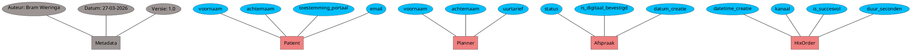

```plantuml
@startchen
<style>
.red {
BackGroundColor #f08080
FontColor #000000
}
.blue {
BackGroundColor #00bfff
FontColor #000000
}
.green {
BackGroundColor #90ee90
FontColor #000000
}
.grey {
BackGroundColor #9C9594
FontColor #000000
}
</style>

' Metadata
entity Metadata <<grey>> {
	"Auteur: Bram Wieringa" as auteur <<grey>> {
	}
	"Datum: 27-03-2026" as datumvandaag <<grey>> {
	}
	"Versie: 1.0" as versie <<grey>> {
	}
}

' Entities
entity Patient <<red>> {
	voornaam <<blue>> {
	}
	achternaam <<blue>> {
	}
	toestemming_portaal <<blue>> {
	}
	email <<blue>> {
	}
}

entity Planner <<red>> {
	voornaam <<blue>> {
	}
	achternaam <<blue>> {
	}
	uurtarief <<blue>> {
	}
}

entity Afspraak <<red>> {
	status <<blue>> {
	}
	is_digitaal_bevestigd <<blue>> {
	}
	datum_creatie <<blue>> {
	}
}

entity HixOrder <<red>> {
	datetime_creatie <<blue>> {
	}
	kanaal <<blue>> {
	}
	is_succesvol <<blue>> {
	}
	duur_seconden <<blue>> {
	}
	
}


@endchen
```