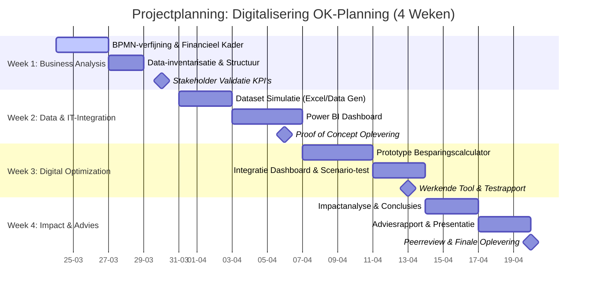

## Projectplanning: Digitalisering OK-Planning (4 Weken)
### Week 1: Business Analysis & Data Design
_Focus: Het fundament leggen en de nulmeting concretiseren._

- **Activiteiten:**
    - **BPMN-verfijning:** Het bestaande proces uit 1a uitbreiden en versimpelen met de financiële meetpunten (waar ontstaat de NVAT?).
    - **Data-inventarisatie:** Definiëren van de exacte datastructuur (ERD Chen-notatie) die nodig is voor de CPB-berekening.
    - **Stakeholder check:** Kort fictief overleg met de 'Manager OK-planners' om de KPI's (CPB, NVAT) te valideren. 'Manager OK-planners' worden gedaan door AI
- **Deliverable:** Definitief Business Analysis Document (Aanvulling op versie 1.1).
    

### Week 2: Data & IT-Integration (The Proof of Concept)
_Focus: Van theorie naar cijfers._

- **Activiteiten:**
    - **Dataverzameling/Simulatie:** ERD-Crowsfeetnotatie maken op basis van de ERD Chen notatie, vervolgens daarvoor data generen met mockdata python script
    - **Power BI Ontwikkeling (Backend):** Laden van data, opschonen in Power Query en het leggen van relaties.
    - **Dashboarding:** Opzet van de 'Must Haves' uit de MoSCoW-analyse (Nulmeting en NVAT-monitor).
- **Deliverable:** Eerste versie Power BI Dashboard (POC).
    

### Week 3: Digital Optimization & Implementation
_Focus: De oplossing bouwen en testen._

- **Activiteiten:**
    - **Prototype bouwen:** Ontwikkelen van een eenvoudige "Besparingscalculator" (bijv. in Excel met macro's of een Power App laag) die de impact van de _Digital Adoption Rate_ simuleert.
    - **Integratie:** De calculator koppelen aan het Power BI dashboard (de 'Should Haves').
    - **Testen:** Controleren of de berekeningen achter de CPB en FTE-besparing logisch kloppen bij verschillende scenario's.
- **Deliverable:** Werkend prototype van de optimalisatie-tool.
    

### Week 4: Business Impact & Rapportage
_Focus: Resultaten interpreteren en presenteren._

- **Activiteiten:**
    - **Impactanalyse:** De resultaten van de simulatie vertalen naar een concreet advies (bijv. "Bij 60% adoptie besparen we 1.2 FTE").
    - **Adviesrapport:** Het documenteren van de bevindingen, de gebruikte IT-componenten en de aanbevelingen voor fase 2.
    - **Peerreview:** Presenteren aan medestudenten en feedback verwerken.
        
- **Deliverable:** Integraal Adviesrapport & Eindpresentatie.
