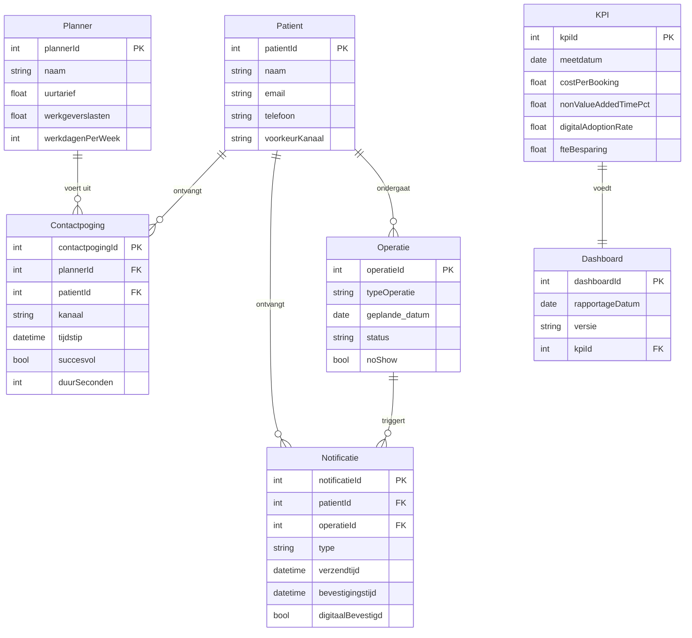

```mermaid
erDiagram

  Planner {
    int plannerId PK
    string naam
    float uurtarief
    float werkgeverslasten
    int werkdagenPerWeek
  }

  Contactpoging {
    int contactpogingId PK
    int plannerId FK
    int patientId FK
    string kanaal
    datetime tijdstip
    bool succesvol
    int duurSeconden
  }

  Patient {
    int patientId PK
    string naam
    string email
    string telefoon
    string voorkeurKanaal
  }

  Notificatie {
    int notificatieId PK
    int patientId FK
    int operatieId FK
    string type
    datetime verzendtijd
    datetime bevestigingstijd
    bool digitaalBevestigd
  }

  Operatie {
    int operatieId PK
    string typeOperatie
    date geplande_datum
    string status
    bool noShow
  }

  KPI {
    int kpiId PK
    date meetdatum
    float costPerBooking
    float nonValueAddedTimePct
    float digitalAdoptionRate
    float fteBesparing
  }

  Dashboard {
    int dashboardId PK
    date rapportageDatum
    string versie
    int kpiId FK
  }

  Planner    ||--o{ Contactpoging : "voert uit"
  Patient    ||--o{ Contactpoging : "ontvangt"
  Patient    ||--o{ Notificatie   : "ontvangt"
  Patient    ||--o{ Operatie      : "ondergaat"
  Operatie   ||--o{ Notificatie   : "triggert"
  KPI        ||--||  Dashboard    : "voedt"
    
    %% Eén-op-één relaties
    %% A ||--|| B : "Precies 1 op Precies 1"
    %% A ||--o| C : "Precies 1 op 0 of 1"
    %% Eén-op-veel relaties
    %% D ||--|{ E : "Precies 1 op 1 of meer"
    %% F ||--o{ G : "Precies 1 op 0 of meer"
    %% Veel-op-veel (of optionele) relaties
    %% H }|--|{ I : "1 of meer op 1 of meer"
    %% J }o--o{ K : "0 of meer op 0 of meer"
    %% L }o--o| M : "0 of meer op 0 of 1"
```