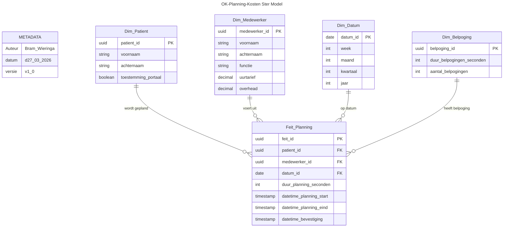

```mermaid
---
title: OK-Planning-Kosten Ster Model
---
erDiagram
    METADATA {
	    Auteur Bram_Wieringa
	    datum d27_03_2026
	    versie v1_0
    }
    
	Dim_Patient {
		uuid patient_id PK
		string voornaam
		string achternaam
		boolean toestemming_portaal
	}
	
	Dim_Medewerker {
		uuid medewerker_id PK
		string voornaam
		string achternaam
		string functie
		decimal uurtarief
		decimal overhead
	}
	
	Dim_Datum {
		date datum_id PK
		int week
		int maand
		int kwartaal
		int jaar
	}
	
	Dim_Belpoging {
		uuid belpoging_id PK
		int duur_belpogingen_seconden
		int aantal_belpogingen
	}
	
	Feit_Planning {
		uuid feit_id PK
		uuid patient_id FK
		uuid medewerker_id FK
		date datum_id FK
		int duur_planning_seconden
		timestamp datetime_planning_start
		timestamp datetime_planning_eind
		timestamp datetime_bevestiging
	}
	
	Dim_Patient    ||--o{ Feit_Planning : "wordt gepland"
	Dim_Medewerker ||--o{ Feit_Planning : "voert uit"
	Dim_Datum      ||--o{ Feit_Planning : "op datum"
	Dim_Belpoging   ||--o{ Feit_Planning : "heeft belpoging"
```