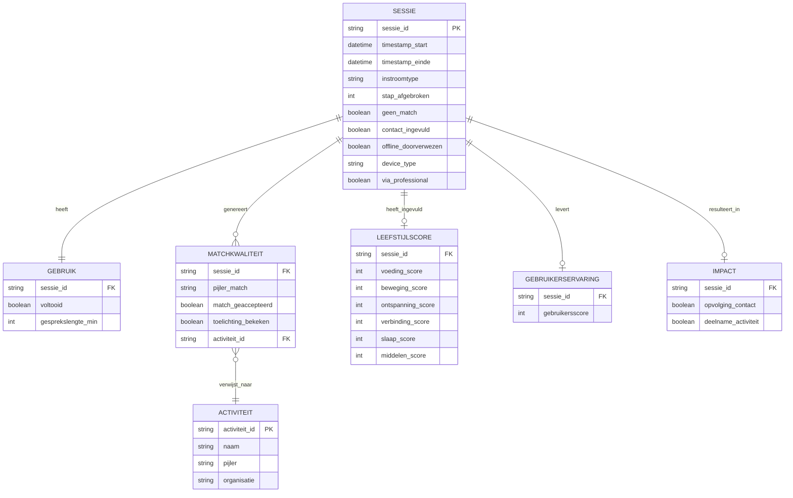

```mermaid
erDiagram
    SESSIE {
        string sessie_id PK
        datetime timestamp_start
        datetime timestamp_einde
        string instroomtype
        int stap_afgebroken
        boolean geen_match
        boolean contact_ingevuld
        boolean offline_doorverwezen
        string device_type
        boolean via_professional
    }

    GEBRUIK {
        string sessie_id FK
        boolean voltooid
        int gesprekslengte_min
    }

    MATCHKWALITEIT {
        string sessie_id FK
        string pijler_match
        boolean match_geaccepteerd
        boolean toelichting_bekeken
        string activiteit_id FK
    }

	LEEFSTIJLSCORE {
		string sessie_id FK
		int voeding_score
		int beweging_score
		int ontspanning_score
		int verbinding_score
		int slaap_score
		int middelen_score
	}

    GEBRUIKERSERVARING {
        string sessie_id FK
        int gebruikersscore
    }

    IMPACT {
        string sessie_id FK
        boolean opvolging_contact
        boolean deelname_activiteit
    }

    ACTIVITEIT {
        string activiteit_id PK
        string naam
        string pijler
        string organisatie
    }

    SESSIE ||--|| GEBRUIK : heeft
    SESSIE ||--o| GEBRUIKERSERVARING : levert
    SESSIE ||--o{ MATCHKWALITEIT : genereert
    SESSIE ||--o| IMPACT : resulteert_in
    SESSIE ||--o| LEEFSTIJLSCORE : heeft_ingevuld
    MATCHKWALITEIT }o--|| ACTIVITEIT : verwijst_naar
```