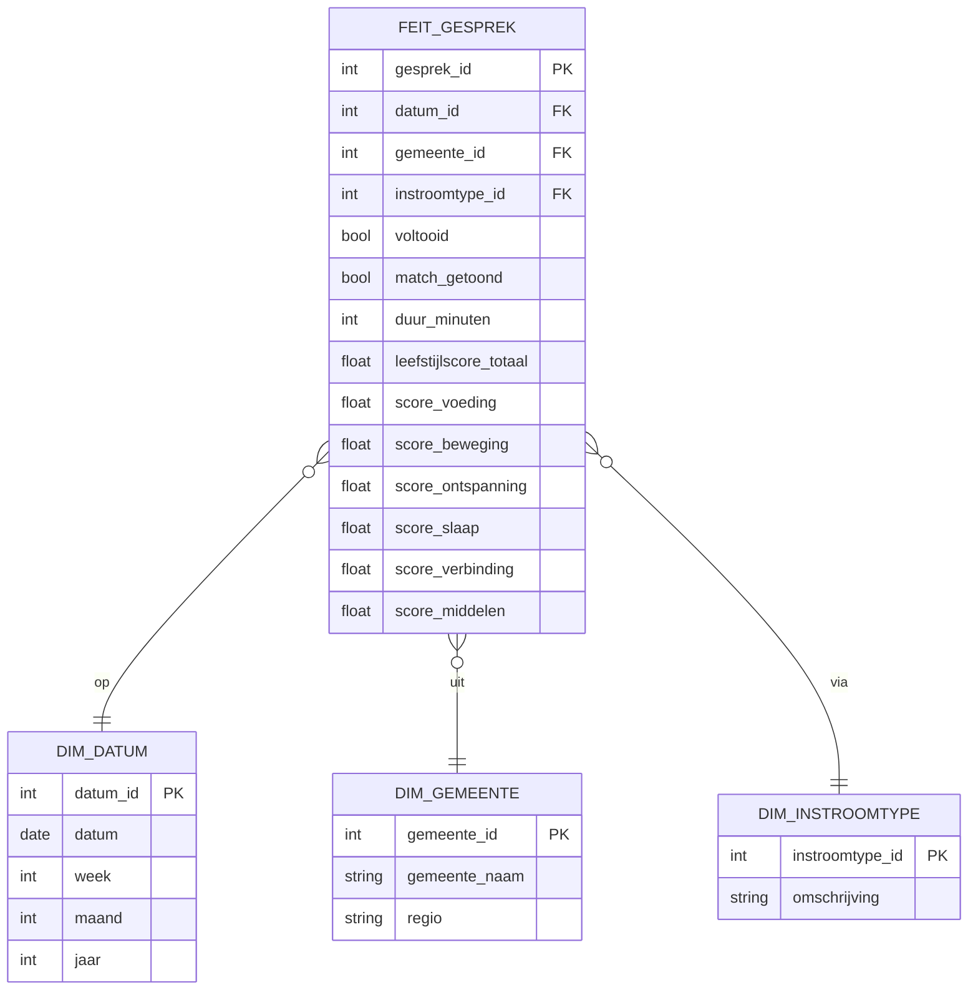

```mermaid
erDiagram
    FEIT_GESPREK {
        int gesprek_id PK
        int datum_id FK
        int gemeente_id FK
        int instroomtype_id FK
        bool voltooid
        bool match_getoond
        int duur_minuten
        float leefstijlscore_totaal
        float score_voeding
        float score_beweging
        float score_ontspanning
        float score_slaap
        float score_verbinding
        float score_middelen
    }
    DIM_DATUM {
        int datum_id PK
        date datum
        int week
        int maand
        int jaar
    }
    DIM_GEMEENTE {
        int gemeente_id PK
        string gemeente_naam
        string regio
    }
    DIM_INSTROOMTYPE {
        int instroomtype_id PK
        string omschrijving
    }
    FEIT_GESPREK }o--|| DIM_DATUM : "op"
    FEIT_GESPREK }o--|| DIM_GEMEENTE : "uit"
    FEIT_GESPREK }o--|| DIM_INSTROOMTYPE : "via"
```