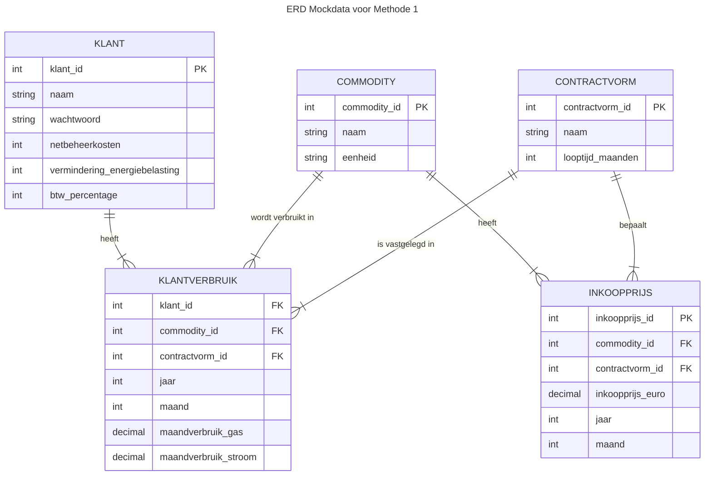

```mermaid
---
title: ERD Mockdata voor Methode 1
---
erDiagram
	
	COMMODITY {
	int commodity_id PK
	string naam
	string eenheid
	}
	
	CONTRACTVORM {
        int contractvorm_id PK
        string naam
        int looptijd_maanden
    }
    
    KLANT {
        int klant_id PK
        string naam
        string wachtwoord
        int netbeheerkosten
        int vermindering_energiebelasting
        int btw_percentage
    }
    
    KLANTVERBRUIK {
        int klant_id FK
        int commodity_id FK
        int contractvorm_id FK
        int jaar
        int maand
        decimal maandverbruik_gas
        decimal maandverbruik_stroom
    }
    
    INKOOPPRIJS {
	    int inkoopprijs_id PK
	    int commodity_id FK
	    int contractvorm_id FK
	    decimal inkoopprijs_euro
	    int jaar
	    int maand
    }
    
	%% Verbindingen voor KLANTVERBRUIK 
	KLANT ||--|{ KLANTVERBRUIK : "heeft" 
	COMMODITY ||--|{ KLANTVERBRUIK : "wordt verbruikt in" 
	CONTRACTVORM ||--|{ KLANTVERBRUIK : "is vastgelegd in" 
	
	%% Verbindingen voor INKOOPPRIJS 
	COMMODITY ||--|{ INKOOPPRIJS : "heeft" 
	CONTRACTVORM ||--|{ INKOOPPRIJS : "bepaalt"
```

METADATA
	Auteur: Bram Wieringa
	Versie 0.12
	Datum 03-11-2026
	DEPENDENCIES: Korte werkbare conclusie welke data hebben we nodig voor Methode 1.pdf"
