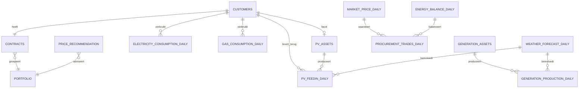

# Entiteit-relatieschets

```mermaid
erDiagram
  CUSTOMERS ||--|| CONTRACTS : heeft
  CUSTOMERS ||--o| PV_ASSETS : bezit
  CUSTOMERS ||--o{ ELECTRICITY_CONSUMPTION_DAILY : verbruikt
  CUSTOMERS ||--o{ GAS_CONSUMPTION_DAILY : verbruikt
  CUSTOMERS ||--o{ PV_FEEDIN_DAILY : levert_terug
  PV_ASSETS ||--o{ PV_FEEDIN_DAILY : produceert
  GENERATION_ASSETS ||--o{ GENERATION_PRODUCTION_DAILY : produceert
  WEATHER_FORECAST_DAILY ||--o{ GENERATION_PRODUCTION_DAILY : beinvloedt
  WEATHER_FORECAST_DAILY ||--o{ PV_FEEDIN_DAILY : beinvloedt
  MARKET_PRICE_DAILY ||--o{ PROCUREMENT_TRADES_DAILY : waardeert
  ENERGY_BALANCE_DAILY ||--o{ PROCUREMENT_TRADES_DAILY : balanceert
  CONTRACTS }o--|| PORTFOLIO : groepeert
  PRICE_RECOMMENDATION }o--|| PORTFOLIO : adviseert
```
